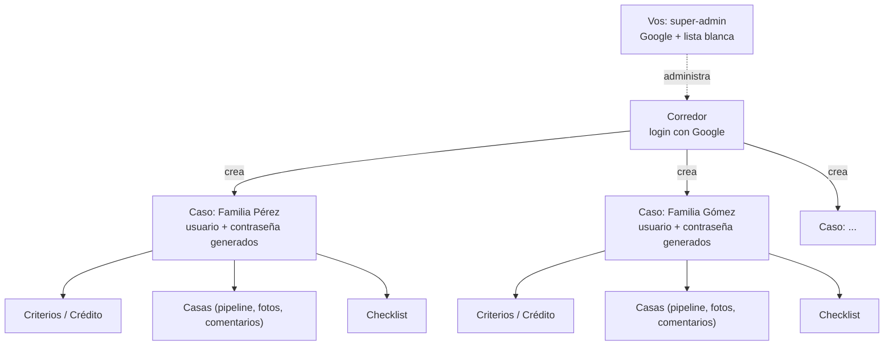

# De herramienta personal a SaaS para corredores

> Documento de arquitectura — Micaso · 13 sept 2026 (estado actualizado 17 sept 2026)
> Estado: **en construcción activa, en vivo en `micaso.com.ar`.** Núcleo multi-caso, panel de corredor (con login real por Google), super-admin con control por corredor y landing pública ya funcionando — ver los addendums fechados en cada sección para el detalle de qué se construyó y cuándo. Falta Mercado Pago (el cobro sigue siendo manual desde `/superadmin`, ver sección 10 y 12) — deliberadamente lo último en construirse.
> Nace de Casa, en producción desde el 12 sept 2026 (41 propiedades, 3 personas usándolo a la fecha)
> Versión con diseño: [artifact publicado](https://claude.ai/code/artifact/613d03c0-8366-4fbd-b641-a59eb5383997)

Propuesta de arquitectura para convertir Casa — hoy una herramienta de uso
privado para una sola búsqueda — en un producto donde un corredor
inmobiliario paga una suscripción mensual y genera, dentro de su panel, un
acceso independiente por cada familia con la que está trabajando.

## 1. Por qué ahora

Una familia busca casa una vez cada varios años, durante unos meses. Un
corredor inmobiliario tiene varios casos abiertos en simultáneo, todo el
año, como trabajo permanente. El primero no sostiene una suscripción
mensual — el segundo sí.

Eso cambia quién es el cliente que paga. No es Lucas, ni Abril, ni ninguna
familia buscando su próxima casa: es Carolina — o cualquier corredor en su
lugar — que hoy ya cumple ese rol de manera informal en esta misma búsqueda
(coordina visitas, negocia con inmobiliarias, arma comparaciones). El
producto le da una herramienta profesional para hacer eso mismo con cada
uno de sus clientes, y a cada familia le llega gratis, vía un link, sin
saber ni que existe una capa de "cuenta corredor" por debajo.

> **Ya validado:** el caso de uso individual (una familia, un corredor
> informal, un crédito, una lista de propiedades) lleva desde el 9 de
> septiembre en uso real — no es una hipótesis, es la unidad que este
> documento propone multiplicar.

## 2. Panorama competitivo

Antes de construir nada vale la pena confirmar que el hueco es real, no
solo asumirlo. Investigación hecha el 13 de septiembre de 2026, separada
en cuatro categorías que a simple vista se confunden entre sí pero
resuelven problemas distintos.

### CRMs para corredores en Argentina y LatAm — gestión interna, no portal para el cliente

| | |
|---|---|
| **Tokko Broker** | se autodenomina "el CRM #1 de LatAm" — publica en 30+ portales, funnel de leads, búsqueda guardada por contacto con alerta automática por mail cuando aparece algo que matchea. En un ranking 2026 quedó detrás de KiteProp (7.0/10 vs 9.4/10): le falta WhatsApp nativo, tasador con comparables, firma digital biométrica. |
| **KiteProp** | hoy el mejor rankeado en Argentina — 30+ portales, WhatsApp nativo, IA para automatizar tareas, tasaciones con comparables. Presencia en Argentina y Chile. |
| **2clics** | más simple, pensado para oficina chica o corredor independiente — el perfil más parecido a Carolina. Funnel + botón de WhatsApp + publicación multi-portal, prueba gratis sin tarjeta. |
| **Xintel, Solution Malls, Datasync** | jugadores menores o de nicho (integraciones contables, sincronización multi-portal) — menor relevancia competitiva directa. |

Ninguno de los cuatro le da al cliente o familia un login propio para ver
su búsqueda. Todos resuelven "cómo gestiono mis leads y publico en
portales" — la alerta automática por mail de Tokko es lo más parecido a
"visibilidad del cliente" que existe hoy, y es un mail, no un panel vivo
con pipeline, comentarios y checklist.

### Portales de anuncios — no compiten, son la fuente

ZonaProp, ArgenProp, MercadoLibre y Properati son los sitios de donde Casa
ya scrapea (sección 5: stack). Alguno tiene "panel del cliente" para
búsquedas guardadas y alertas, pero es una función del portal para
cualquier usuario anónimo — no algo que un corredor arma y comparte con un
cliente puntual.

### Simuladores de crédito UVA — resuelven otra pregunta

CreditosUVA.ar, Valencia Neira, Somos Inmobiliarios e InfoZona son una
categoría madura y con varios jugadores — pero contestan "¿qué banco me
conviene?", comparando tasas de ~25 bancos. Micaso no compite acá: asume
que el crédito **ya está pre-aprobado** y contesta "con ese crédito,
¿cuánto necesito de bolsillo para esta casa puntual?" — un problema
distinto, sin superposición real.

### Portales de colaboración cliente-agente — la categoría existe, pero no acá

| | |
|---|---|
| **OneHome** (Cotality, ex-CoreLogic) | portal con marca del agente, comparación lado a lado, el cliente deja feedback por propiedad. Precio no público. |
| **Trackxi** | portal de cliente + tracker de transacción. US$ 39–199/mes según plan. |
| **Ahsuite** | portal de cliente genérico adoptado por agentes inmobiliarios. US$ 14–24/mes por usuario. |
| **Clinked, HAR Client Portal, SuiteDash** | variantes del mismo concepto, rangos de precio similares. |

Esto valida algo importante: el modelo de negocio funciona — un corredor
paga entre US$ 14 y US$ 200 por mes por esto. Pero ninguno opera en
Argentina, ninguno integra el cálculo hipotecario argentino, y ninguno se
conecta a MercadoLibre, ZonaProp, ArgenProp, RE/MAX o Mudafy como ya hace
Casa.

> **Veredicto:** no es un mercado vacío — la categoría "portal de
> colaboración" existe y factura en EEUU. Pero en Argentina el hueco es
> real: nadie combina portal para el cliente + cálculo hipotecario
> argentino + conexión a los portales locales. Los jugadores grandes de
> acá (Tokko, KiteProp) tienen la escala y la base de corredores para
> copiar esto rápido si lo ven funcionar — el diferenciador de Micaso no
> es tecnológico, es el enfoque, la velocidad de ejecución, y tener a
> Carolina validándolo en uso real ahora mismo (sección 12).

## 3. La unidad base: un caso

Todo lo construido hasta hoy es, en los términos de este documento, **un
caso**. El trabajo de arquitectura no es rehacer esto — es ponerle una capa
arriba que permita tener muchos al mismo tiempo, aislados entre sí, cada
uno con su propio acceso.

| | |
|---|---|
| **Criterios** | zonas de interés e imprescindibles en común a cualquier caso; el perfil financiero varía por tipo (ver abajo) |
| **Casas** | pipeline de 7 estados de búsqueda + papelera recuperable, fotos, comentarios, revisión de visita, plata necesaria calculada contra el presupuesto del caso |
| **Vistas** | comparación de destacadas, mapa aproximado por zona |
| **Agenda** | visitas coordinadas agrupadas por día, en orden cronológico, con botón para descargar el evento al calendario del celular |
| **Checklist** | trámites y documentación, asignable entre los miembros del caso — plantilla distinta por tipo (ver abajo) |
| **Carga de propiedades** | pegar un link (MercadoLibre, ZonaProp, ArgenProp, RE/MAX, Mudafy) autocompleta título, fotos y precio |

> **Implementado (15 sept 2026): agenda de visitas.** Nueva pestaña
> `/caso/agenda` — lista las visitas coordinadas en orden cronológico,
> agrupadas por día, con un botón para descargar un evento `.ics` válido
> (RFC5545, offset fijo de Argentina UTC-3) a cualquier calendario del
> celular. De paso se unificaron dos componentes que estaban duplicados
> entre `HouseCard` y el inicio del caso (`VisitaCoordinadaBadge`,
> `EmptyState`).
>
> **Implementado (17 sept 2026): separar pasadas de próximas.** El
> filtro original de `/caso/agenda` solo mostraba visitas con fecha
> futura (`visitaFecha >= hoy`) — una visita ya pasada simplemente
> desaparecía de la lista, sin aviso ni forma de verla. Ahora se agrupan
> en dos secciones, "Próximas" y "Visitas pasadas" (esta última, más
> recientes primero), en vez de perderse.

### Tipo de caso: no todos buscan lo mismo

Comprar con crédito hipotecario y alquilar tienen un perfil financiero
distinto de raíz — no es solo una etiqueta, cambia qué datos hay que
pedir:

- **Compra:** capital disponible, crédito pre-aprobado (banco, monto,
  tasa), cuota estimada. Alimenta la calculadora de cuota francesa y la
  "plata necesaria" por casa, tal como existe hoy.
- **Alquiler:** presupuesto mensual y presupuesto de entrada (depósito,
  comisión inmobiliaria, primer mes, seguro de caución o garantía).
  Alimenta un cálculo distinto — gastos iniciales, no cuota francesa.
- **Otro:** sin calculadora específica por ahora — un campo de
  presupuesto libre alcanza hasta que haya un caso real de este tipo.

El checklist de trámites cambia igual de raíz (escritura y tasación no
tienen nada que ver con seguro de caución y recibos de sueldo). Lo único
100% común a los tres tipos es el pipeline de casas: estados, fotos,
comentarios, contacto, comparación y mapa no dependen de si el caso es
compra, alquiler u otra cosa.

> **Implementado (14 sept 2026): compra se divide en con crédito / al
> contado.** `LoanInfo` suma `hasCredit: boolean` y `bankName: string` —
> con `hasCredit: false` el caso muestra solo el capital disponible ("Al
> contado, con USD X–Y disponibles"), sin banco, cuota ni condiciones; el
> corredor lo tildea desde el mismo editor de crédito. La calculadora de
> cuota francesa sigue aplicando solo cuando `hasCredit` es `true`.

## 4. Arquitectura objetivo

Tres niveles, no uno. Hoy existe un solo login compartido para todo el
mundo. El modelo nuevo separa **tu panel de super-admin** (uno solo, el
tuyo) de **el panel de cada corredor** (una cuenta por corredor) de
**cada caso** (un acceso propio por familia, generado desde el panel de
su corredor).

Cada caso es una copia aislada de lo que existe hoy — nada se comparte
entre familias.

### Autenticación — tres puertas, una sola con OAuth

- **Vos (super-admin) → tu panel:** el mismo login con Google que un
  corredor, pero tu email vive en una lista blanca (`ADMIN_EMAILS`) que
  te manda a un panel distinto — no hace falta un sistema de roles
  aparte.
- **Corredor → panel:** login con Google. **Decisión revisada** respecto
  a la primera versión de este documento, que proponía usuario/contraseña
  propio — tiene más sentido OAuth para un cliente que vuelve todos los
  días y entra desde una landing pública: sin contraseña que recuperar,
  signup más corto. Sesión larga, ve la lista de sus casos.

  > **Confirmado funcionando de punta a punta (17 sept 2026).** El botón
  > "Continuar con Google" en `/panel/login` redirige a una pantalla real
  > de consentimiento de Google ("Sign in with Google — to continue to
  > Micaso"), con `AUTH_GOOGLE_ID`/`AUTH_GOOGLE_SECRET` ya cargados — no
  > es solo la decisión de diseño de este párrafo, el flujo de OAuth ya
  > está en pie. **Resuelto (17 sept 2026):** `https://www.micaso.com.ar/api/auth/callback/google`
  > ya está sumado a los redirect URIs autorizados del proyecto en Google
  > Cloud Console — login con Google funcionando tanto en local como en
  > producción.
- **Caso → familia:** usuario/contraseña simple generados al crear el
  caso (no elegidos a mano por el corredor). Cortos está bien — no se
  comparte información bancaria — pero siguen siendo generados al azar y
  únicos por caso, nunca un `1234` repetido entre casos: el presupuesto o
  el teléfono de contacto de una familia no es "sensible" en sentido
  legal, pero tampoco es para que lo mire el cliente de otro corredor
  adivinando una URL.

### Namespacing de datos

Hoy cada colección vive en una clave global de Redis. Pasa a estar
prefijada por caso:

| Hoy | Con casos |
|---|---|
| `houses` | `case:{caseId}:houses` |
| `checklist` | `case:{caseId}:checklist` |
| `criteria` | `case:{caseId}:criteria` |
| *(no existe)* | `brokers` — cuentas de corredor: login, `nombreMarca`/`imagenUrl`, y estado de suscripción (`mpPreapprovalId`, `subscriptionStatus`, `trialEndsAt`) |
| *(no existe)* | `cases` — metadata: **título del caso** (editable, no fijo desde la creación), credenciales, `brokerId`, fecha de creación, `estado` (activo/cerrado) |

## 5. Stack tecnológico

Lo mínimo nuevo para no reinventar lo que ya resuelven bien otros.

### Ya en uso, sin cambios

- **Next.js 16 (App Router) + React 19 + TypeScript + Tailwind CSS v4** —
  el mismo stack de hoy. Esta capa lo extiende, no lo reescribe.
- **Vercel** — hosting y auto-deploy desde GitHub. El proyecto sigue
  siendo uno solo; no hace falta infraestructura separada para
  multi-tenant.
- **Upstash Redis** — sigue siendo la base de datos, ahora particionada
  por caso (ver sección 4). Por qué alcanza por ahora, y cuándo dejaría
  de alcanzar: ver abajo.
- **Leaflet + OpenStreetMap** — el mapa aproximado por zona no cambia.
- **El scraper actual** (meta tags, JSON-LD, sin navegador headless) — la
  lógica no cambia, solo el volumen (ver riesgo de escala en sección 9).

### Nuevo, hay que sumarlo

- **Auth.js** (ex-NextAuth) con proveedor de Google — resuelve el login
  OAuth de corredor y super-admin. Es la opción estándar en Next.js para
  esto; evita escribir el flujo de OAuth a mano.
- **Mercado Pago** (Suscripciones / API de Preapproval) — cobro recurrente
  y notificaciones de pago para enterarse de altas, rechazos y
  cancelaciones. Reemplaza a Stripe (ver sección 9: Stripe no es viable
  para un negocio radicado en Argentina). A diferencia de Stripe, no trae
  un Customer Portal alojado — cambiar de plan o cancelar necesita una
  pantalla propia mínima (ver sección 8), algo que con Stripe no hubiera
  hecho falta construir.
- **Dominio propio** — hoy la app original vive en
  `home-blush-one.vercel.app`; una landing pública que le vende a
  desconocidos necesita un dominio de verdad. Nombre público del
  producto: **decidido, se llama Micaso** (ver sección 11) — "Casa" queda
  como nombre interno/histórico de la herramienta original, no como marca
  pública.

  > **Implementado (verificado 15 sept 2026):** `micaso.com.ar` está
  > comprado y en vivo, sirviendo la landing real (headlines y precios
  > de sección 11 coinciden). Ver también sección 11, que tenía esto
  > anotado como pendiente.
- **Almacenamiento de imágenes subidas** (Vercel Blob u otro) — hoy todas
  las fotos de la app vienen de URLs externas (scrapeadas de un aviso, o
  pegadas a mano en el editor); la foto de perfil del corredor es la
  primera imagen que alguien sube de verdad en vez de pegar un link, así
  que hace falta un lugar donde guardarla.

  > **Implementado (15 sept 2026): Vercel Blob para fotos de casa, no
  > para la de perfil.** La foto de perfil del corredor sigue sin usar
  > esto — es una miniatura de 256px que se guarda como data URL adentro
  > del mismo registro (ver sección 6, ya estaba así desde el 14 sept).
  > Lo que sí necesitaba storage real eran las fotos que se suben a mano
  > en `EditHouseModal` (antes solo se podía pegar una URL): una casa
  > puede tener varias, y embeberlas como texto en el mismo objeto Redis
  > que ya comparten título/checklist/comentarios de todas las casas del
  > caso agrandaría esa clave en cada mutación — justo lo que la sección
  > 9 ya marca como el punto débil de `dbUpdate` en Redis. `npm install
  > @vercel/blob`, ruta nueva `app/api/houses/photo`, comprimida a 1600px
  > lado mayor / calidad 0.85 antes de subir.
  >
  > **Probado de punta a punta (15 sept 2026) y funcionando.** Primer
  > intento contra el store `micaso-blob`: falló porque se había creado
  > en modo Privado ("Cannot use public access on a private store"), y
  > las fotos de casa necesitan acceso público (se muestran con un
  > `` común a cualquiera con el link del caso, sin login). No tenía
  > forma de pasarlo a público después de creado, así que se borró y se
  > creó de nuevo en modo público. Con ese store, probado el camino
  > completo contra un caso real (no el demo, que tiene su propio
  > bloqueo de escritura): subir un archivo → URL pública de
  > `*.public.blob.vercel-storage.com` devuelta y confirmada accesible
  > → guardada en `images` de una casa vía el mismo PATCH que ya usa
  > `EditHouseModal`. Falta probarlo a mano en el navegador (esto se
  > probó por API), pero el mecanismo nuevo — auth, subida a Blob,
  > servido público, persistencia — ya está verificado real.

### Deliberadamente no se suma nada

- **Servicio de email transaccional** (Resend, SendGrid, etc.) — Mercado
  Pago también notifica cobros exitosos y fallidos a quien paga por sus
  propios medios; a confirmar cuando se implemente si alcanza sin sumar
  nada más, pero la idea de no construir un servicio de mail aparte para
  v1 se mantiene.
- **Herramienta de analytics propia** — las métricas del panel de
  super-admin (sección 7) pueden salir directo del dashboard de Mercado
  Pago (altas, bajas, ingreso mensual) en vez de calcularlas a mano; solo
  la lista de corredores y las acciones manuales necesitan pantalla
  propia.

### Base de datos: por qué Redis alcanza por ahora, y cuándo dejaría de alcanzar

Hoy cada colección (`houses`, `checklist`, `criteria`) vive en una sola
clave por caso, guardada como un array — leer o escribir un solo campo de
una sola casa implica traer y volver a guardar el array completo. Es una
limitación ya documentada y aceptada para 3 personas en un caso; con
casos multiplicándose, sigue siendo aceptable **si cada caso mantiene un
volumen chico** (decenas de casas, no miles), porque el "radio de
explosión" de una escritura pesada queda contenido dentro de un caso, no
de toda la plataforma.

**Mejora barata, sin cambiar de tecnología:** el próximo paso natural —ya
anticipado en el README de Casa— es que cada casa pase a ser su propia
clave (`case:{caseId}:house:{houseId}`) en vez de un elemento de un array
compartido. Sigue siendo Redis, sigue siendo el mismo Upstash, pero
actualizar el checklist de una casa deja de tocar las otras cuarenta.

**Cuándo de verdad conviene otra base de datos (Postgres u otra
relacional):** el disparador no es "cuántos corredores" — es que la
decisión de la sección 6 (casos siempre aislados, sin vista unificada)
cambie. Consultar propiedades cruzando varios casos, o darle al panel de
super-admin reportes de verdad en vez de una lista simple, son consultas
relacionales que Redis hace mal y Postgres hace bien de fábrica. Ninguna
de las dos está decidida como necesaria hoy, así que migrar de base de
datos es resolver un problema que todavía no existe.

> **En resumen: una sola base de datos, no una por corredor.** El
> aislamiento entre casos es por nombre de clave (`case:{caseId}:...`,
> sección 4), no por infraestructura separada — crear un caso nuevo
> agrega un puñado de claves a la misma base, nunca una base nueva. Nada
> de lo nuevo agrega otra base de datos de verdad: Auth.js con Google
> puede andar con la sesión en una cookie firmada, sin guardar nada en
> Redis; Mercado Pago guarda la facturación de su lado (solo
> referenciamos un ID); y el storage de imágenes guarda archivos sueltos,
> no reemplaza a Redis ni lo complementa con más tablas.

## 6. Panel del corredor

Tres momentos distintos: la landing lo convence, el alta lo registra, el
panel lo engancha todos los días.

### Landing: convencer al corredor, no a la familia

Página pública de marketing, dirigida al corredor — nunca a una familia
(esa nunca la ve, entra directo por su link de caso). Necesita una
propuesta de valor concreta ("organizá a cada cliente de búsqueda de casa
en un lugar, con su propio link privado"), el precio a la vista, y un
único CTA: **empezar prueba gratis**.

### Alta y prueba — sin pedir tarjeta

El alta es entrar con Google — sin formulario de contraseña, la identidad
y el email vienen de la cuenta que usa para loguearse (ver sección 4). Al
entrar por primera vez se le pide nombre de marca para su panel, nada
más. **Decidido: prueba de 14 días sin pedir tarjeta** — entra directo a
un panel vacío, puede crear casos de prueba, y recién al terminar la
prueba se le pide un método de pago para seguir.

### Cobro — plan fijo, con tope de casos activos

**Decisión revisada:** un precio mensual fijo, pero no todo-lo-que-quieras
— la versión anterior de este documento lo dejaba sin tope. Cada plan
incluye una cantidad máxima de **casos activos simultáneos**; abrir más
que eso implica pasar a un plan superior o un cargo por caso extra. Sigue
sin ser cobro por-caso puro — eso ya se había descartado por complicar la
facturación desde el día uno — pero tampoco es un precio plano
desconectado de cuánto usa la herramienta un corredor grande frente a uno
chico.

**Decidido (14 sept 2026): precio y topes — ver sección 11** para el
análisis de costos y el razonamiento completo. Los tres planes:

| Plan | Tope de casos activos | Precio |
|---|---|---|
| Inicial | 5 | USD 13/mes (o $ 18.000 ARS) |
| Profesional | 20 | USD 29/mes (o $ 39.000 ARS) |
| A medida | a medida | a convenir, sin número fijo |

Esto es la razón concreta por la que **cerrar un caso** deja de ser solo
prolijidad — ver "Ciclo de vida de un caso" abajo.

Al terminar la prueba (o antes, si el corredor decide pagar de una), se
inicia una suscripción. **Decisión sobre pasarelas:** hoy está implementado **Mercado Pago** (API de Preapproval) para cobrar en pesos. La interfaz detecta si el usuario está en Argentina (usando headers de Vercel `x-vercel-ip-country`) y muestra $ 18.000 / $ 39.000 ARS. Si está en otro país, muestra USD 13 / USD 29, y más adelante se sumará **Stripe** (o similar) para poder procesar esos pagos internacionales en dólares, ya que Mercado Pago no permite cobrar desde fuera hacia una cuenta local. A diferencia de
lo pensado originalmente con Stripe, Mercado Pago no ofrece un portal
alojado equivalente al Customer Portal: cambiar de plan o cancelar
necesita una pantalla propia mínima dentro del panel (ver sección 8), en
vez de tercerizarla del todo. Si falla un cobro o no carga tarjeta al
terminar la prueba, la respuesta por ahora es pasar el panel a
solo-lectura hasta que se resuelva, no cortar el acceso de un día para el
otro (detalle sin cerrar del todo, ver sección 9).

### Internacionalización y Multidioma (Futuro)

Para la expansión a otros países, la arquitectura aprovechará la misma lógica que hoy cambia la moneda de los precios (detectar el país mediante el header `x-vercel-ip-country` inyectado por Vercel, combinado con `Accept-Language` del navegador):
- **Moneda:** Ya está preparado para mostrar USD a IPs fuera de Argentina. El siguiente paso es acoplar esos precios en USD a una integración con **Stripe** (Checkout Sessions y Webhooks equivalentes a los de Mercado Pago) que procese el cobro internacional.
- **Idioma:** La aplicación implementará un mecanismo de i18n (ej. `next-intl` o diccionarios manuales, aprovechando el App Router de Next.js). Si se detecta un país no hispanohablante o el `Accept-Language` pide inglés, la app entera (landing page, panel del corredor y el caso de los clientes) se renderizará en inglés. El diseño base ya es neutro y solo requerirá externalizar los strings de texto duro actuales.
- **Dominio (.com vs .com.ar):** La app opera en `micaso.com.ar`, lo cual asocia fuertemente el producto a Argentina (afectando la confianza y el SEO en el exterior). La estrategia para el lanzamiento internacional será adquirir un dominio global (ej. `.com`, `.app` o `.io`) y configurarlo en Vercel como el dominio principal. El `.com.ar` quedará redirigido hacia el nuevo dominio o como alias exclusivo para el mercado local.
- **Lógica de Negocio y Formatos Locales:** Actualmente el modelo asume reglas argentinas (scraping de ZonaProp/Argenprop, 8.5% de gastos de escritura, separadores de miles). Para salir al exterior, esta lógica deberá abstraerse mediante "adaptadores regionales", permitiendo leer links de otros portales (Zillow, Idealista, etc.), aplicar fórmulas hipotecarias locales (ej. Closing Costs en vez de Escrituración) y renderizar fechas/monedas según el *locale* de la familia.

### Ciclo de vida de un caso: cuánto dura un link

**Decidido: el corredor cierra el caso a mano, no expira solo.** Mientras
un caso está activo, su link no tiene fecha de vencimiento — dura lo que
dure la búsqueda real, sea un mes o un año. El corredor necesita un botón
explícito para **cerrar y terminar** un caso cuando la familia ya compró,
alquiló, o simplemente dejó de buscar.

Al cerrar un caso:
- Deja de contar contra el tope de casos activos del plan (ver Cobro,
  arriba) — el incentivo para el corredor es real, no solo prolijidad.
- Pasa a modo solo-lectura en vez de cortarse de un día para el otro —
  mismo criterio que si el corredor deja de pagar (sección 9): la familia
  sigue viendo su historial, pero no puede seguir cargando casas ni
  comentarios nuevos.

Esto es más simple que el "archivado automático" que ya está fuera de
alcance (sección 10): ahí lo que se descarta es que el sistema *detecte
solo* que una compra se cerró; esto es un botón que aprieta el corredor
cuando él sabe que terminó, nada de inferir nada.

### Una vez adentro: qué ve el corredor

Lo mínimo que necesita el panel para ser útil desde el primer día:

- Lista de casos: nombre del cliente, link/credenciales para copiar y
  mandar, un resumen rápido (cuántas pendientes, destacadas, última
  actividad).
- Botón para crear un caso nuevo — genera usuario/contraseña, le pone un
  título (ver abajo) y arranca ese caso vacío. Bloqueado si ya llegó al
  tope de casos activos de su plan. **Decidido: pide solo lo mínimo**
  (título, tipo de caso) para no frenar al corredor con un formulario
  largo — los criterios (presupuesto, zonas, crédito o alquiler) se
  completan después, desde la misma pantalla de Criterios que ya existe
  hoy: el corredor los carga si ya los tiene de charlar con el cliente, o
  la familia los completa ella misma la primera vez que entra con su
  link. No hace falta un asistente de onboarding aparte — es el mismo
  formulario editable de siempre, quien llegue primero lo llena.
- Botón para cerrar un caso (ver "Ciclo de vida de un caso", arriba) — y
  un indicador de cuántos casos activos tiene contra el tope de su plan.
- Sin las 41 propiedades de Lucas de arranque: cada caso nuevo empieza en
  blanco, no con el seed actual (ver sección 8).
- **Marca propia:** nombre e imagen de perfil (una foto personal sirve
  igual que un logo — muchos corredores individuales, como Carolina, no
  tienen uno) que el corredor carga una vez en su panel y se muestran en
  todos los casos que ve su cliente — la familia nunca ve "Micaso" como
  marca, ve la del corredor. Decidido: sí va, ver sección 8.
- **Título del caso, editable:** el corredor le pone un nombre a cada caso
  al crearlo (ej. "Familia Pérez") y puede cambiarlo cuando quiera — no es
  solo una etiqueta interna para ordenarse, es lo que la familia ve como
  encabezado dentro de su propio caso.

> **Decidido: casos siempre aislados, sin vista unificada en v1.** Cada
> propiedad pertenece a un único caso — no hay relación muchos-a-muchos
> entre casas y casos. Si más adelante un corredor necesita evitar cargar
> la misma dirección dos veces en casos distintos, alcanza con una
> búsqueda de solo lectura entre sus propios casos (una consulta, no un
> cambio de modelo de datos) — se agrega cuando haga falta, no ahora.
> Esto también baja la urgencia de migrar a una base relacional (sección
> 5): sin necesidad real de cruzar datos entre casos, Redis con el
> namespacing actual sigue alcanzando.

> **Implementado (14 sept 2026): dashboard del panel, entrar/compartir
> caso, foto de perfil.** `/panel` ya no es solo la lista de casos:
> arriba muestra tres KPI (casos activos contra el tope del plan,
> propiedades en seguimiento, próxima visita coordinada) y, si hay algo
> que atender, un bloque "Necesita tu atención" con acciones vencidas y
> visitas dentro de las próximas 48 horas, cada una con link directo a su
> caso (`getCaseSummary` en `lib/store.ts` calcula esto por caso, una vez
> por carga de página). Cada fila de caso suma un resumen corto
> (pendientes, destacadas, última actividad) y un borde de color que
> avisa si algo vence. "Entrar como este caso" pasa a **"Entrar al
> caso"**, con un botón **Compartir** al lado que arma el mensaje de
> WhatsApp (usuario, contraseña y una explicación corta) para que el
> corredor se lo mande a su cliente sin escribirlo de cero. La foto de
> perfil (sección 6, "Marca propia") ya se puede subir: se comprime en el
> navegador a una miniatura de 256px y se guarda como parte del registro
> del corredor (`brokers.imagenUrl` pasa a poder ser una data URL, no
> solo la foto de Google) — evita depender del storage de imágenes
> externo (sección 5) mientras no esté configurado; si más adelante hace
> falta subir imágenes pesadas (fotos de propiedades, por ejemplo), ahí sí
> hace falta Vercel Blob u otro de verdad.

> **Implementado (15 sept 2026): compartir una propiedad, carga manual,
> PWA básica.**
> - **Compartir por WhatsApp desde la tarjeta de la casa** (no ya solo
>   las credenciales del caso, más arriba) — un botón en `HouseCard`
>   arma "Mirá esta casa que guardé en Micaso: título — precio, link"
>   para que la familia se la reenvíe a su pareja o al corredor sin
>   escribirlo a mano.
> - **Carga manual de una propiedad** en `AddHouseModal` — un toggle
>   "¿No tenés un link? Cargar los datos a mano" para propiedades de
>   dueño directo o una ficha privada que no tiene página de portal.
>   `House.url` pasa a ser `string | null` (antes obligatorio) para
>   representar esto de verdad, no un URL inventado. La UI que dependía
>   de un aviso original (botón "actualizar desde el aviso", el link de
>   la foto de tapa) se esconde para estas casas en vez de apuntar a un
>   link roto.
> - **PWA básica**: `app/manifest.ts` + íconos generados con `next/og`
>   en 192/512px (`app/icons/*`) y el ícono de iOS
>   (`app/apple-icon.tsx`) — familia y corredor pueden "Agregar a
>   pantalla de inicio" y abrir Micaso en pantalla completa. Encontrado
>   en la prueba real (no algo obvio de antemano): `proxy.ts` bloqueaba
>   `/manifest.webmanifest` y los íconos detrás del login — el
>   navegador los pide sin sesión, incluso parado en `/login`, así que
>   quedaron sumados a `PUBLIC_PATHS`.
>
> Probando la carga manual con clicks reales en el navegador (no solo
> por API) aparecieron dos bugs de verdad, sin relación directa con
> estas tres features — ver "La reescritura de 14 sept no fue completa"
> y "Segundo hallazgo, más de raíz" un poco más abajo en esta misma
> sección 9. Las tres features se volvieron a probar de punta a punta
> con el navegador real después del segundo arreglo (lock de archivo) y
> siguen funcionando: WhatsApp arma el mensaje con título/precio/link,
> la carga manual persiste sin perderse, y el manifest/íconos cargan sin
> sesión.

> **Implementado (15 sept 2026): buscador y tabs en la lista de casos,
> integrantes opcionales al crear un caso.** `CaseList.tsx` suma pestañas
> Activos/Todos/Cerrados (con contador) y un buscador por título,
> integrante o usuario de caso — antes la lista era un `.map()` plano sin
> filtrar, incómodo en cuanto un corredor tiene más de un puñado de
> casos. `CreateCaseModal` suma un campo opcional para cargar los nombres
> de la familia ya en el alta (sigue sin ser obligatorio — el criterio de
> "quien llegue primero los completa" de la sección 6 no cambia). `/caso`
> y `/panel` comparten un `EmptyState` para "todavía no hay nada acá" en
> vez de un mensaje distinto por pantalla.

> **Implementado (16 sept 2026): botón para forzar la instalación como
> PWA.** La PWA básica de arriba dependía de que la persona encontrara
> "Agregar a pantalla de inicio" en el menú del navegador —
> `InstallAppButton` escucha `beforeinstallprompt` en Android/Chrome para
> disparar el prompt nativo con un toque; en iOS Safari (sin esa API)
> muestra instrucciones manuales ("Compartir → Agregar a inicio"). Vive
> en `Nav.tsx` (familia) y, desde el 17 sept 2026, también en el header
> de `/panel` (corredor).
>
> **Revisado (17 sept 2026): funciona sin service worker.** El proyecto
> no tiene uno — el criterio de instalabilidad de Chrome ya no lo exige
> de forma estricta, y en la práctica el prompt apareció en producción
> sin él. Revisión de código: `manifest.ts` trae los campos que Chrome
> chequea (`name`, `short_name`, `icons` 192/512, `start_url`, `display:
> "standalone"`); `app/icons/192` y `app/icons/512` (`next/og`) generan
> esos íconos, y `app/apple-icon.tsx` cubre el ícono de iOS vía la
> convención de archivo de Next.js (`appleWebApp` en `layout.tsx` agrega
> los meta tags de Safari). `InstallAppButton` no muestra el botón si
> `matchMedia("(display-mode: standalone)")` ya es true (evita ofrecer
> instalar algo ya instalado). Sin service worker la app no funciona
> offline ni cachea nada — no es un problema hoy porque cada pantalla
> depende de datos en vivo, pero si más adelante se quiere soporte
> offline, ahí sí hace falta sumar uno.

> **Implementado (16 sept 2026): panel usable en mobile de punta a
> punta.** El header con el email del corredor, las tabs de `CaseList` y
> la fila de cada caso desbordaban horizontalmente en mobile —
> `overflow-x: clip` en `html`/`body` más `min-w-0`/`truncate`/`shrink-0`
> puntuales, sin romper los headers `sticky`. El aviso "pasarela de cobro
> en desarrollo" de `/panel/plan` pasa a `PlanGatewayNotice`, descartable
> con ✕ y que recuerda la elección en `localStorage` vía
> `useSyncExternalStore` (sin parpadeo de hidratación).

> **Auditoría de UX e implementado (17 sept 2026): varios bugs reales de
> punta a punta, probados en navegador real, no solo por código.**
> - **Calculadora:** un valor negativo en "Valor de la propiedad" o
>   "Ahorro propio" rompía los totales (gastos y cuota negativos) — los
>   inputs ahora sanitizan con `Math.max(0, ...)` y `min={0}`.
> - **Confirmaciones críticas del panel:** "Cerrar caso" y "Regenerar
>   clave" mostraban un toast de Sonner abajo a la derecha, con un botón
>   de acción que desaparecía solo a los 12 segundos — fácil de pasar
>   por alto en un celular. Ahora abren un modal centrado (Cancelar /
>   Confirmar), en `CaseRow` (panel del corredor) y en el nuevo
>   `AdminCaseCard` (super-admin, ver sección 7).
> - **Carga de propiedades:** en el modo "pegar un link" alcanzaba con
>   pegar cualquier texto (sin que llegara a scrapearse nada) para
>   guardar una casa con la URL cruda como título y precio "-" —
>   `AddHouseModal` ahora exige un título real (scrapeado o tipeado a
>   mano) en los dos modos antes de habilitar "Agregar".
> - **`/panel/plan`:** se sacaron las etiquetas redundantes "Checkout /
>   Pago online en desarrollo" — el aviso de `PlanGatewayNotice` de
>   arriba ya cubre lo mismo; queda directo el botón "Coordinar por
>   WhatsApp".
> - **React 19:** `ClientOnboardingModal` y `LoginForm` llamaban
>   `setState` de forma síncrona dentro del cuerpo de un `useEffect` al
>   montar, disparando el lint nuevo `react-hooks/set-state-in-effect`
>   (cascading renders) — se difiere con `setTimeout(..., 0)`, mismo
>   patrón que ya usaba `CalculadoraClient` para restaurar valores de
>   `localStorage`.
>
> Ver también la agenda (sección 3) y el super-admin (sección 7), que
> tuvieron su propio hallazgo el mismo día.

> **Implementado (17 sept 2026): editar perfil (foto y nombre) desde el
> celular.** En el header angosto del panel, `BrokerNameEditor` solo se
> mostraba a partir de `sm:` (`hidden sm:inline-flex`) — pero esa misma
> clase se reutilizaba también para el `<input>` en modo edición, así que
> lo que fuera que disparara la edición en mobile heredaba `display:
> none` y el campo "desaparecía". En mobile ahora solo se ve el círculo
> de foto (`BrokerProfileModal`, nuevo), que abre un modal simple con
> foto y nombre editables; desktop no cambió.
>
> **Bug de fondo encontrado dos veces el mismo día, mismo mecanismo:**
> el modal de confirmación de `CaseRow` y el nuevo `BrokerProfileModal`
> quedaban recortados arriba de la pantalla en vez de centrados en todo
> el viewport. La card de `CaseRow` tiene `transform` en `:hover` y el
> `<header>` de `/panel` tiene `backdrop-filter` (`backdrop-blur-md`) —
> las dos propiedades CSS crean un *containing block* nuevo para
> cualquier hijo `position: fixed`, así que el modal quedaba encerrado
> en esa caja en vez de cubrir toda la pantalla. Mismo arreglo en los
> tres casos afectados (`CaseRow`, `BrokerProfileModal`,
> `InstallAppButton`): `createPortal` a `document.body`.
>
> **Implementado (17 sept 2026): modales tapados por la barra de
> navegación mobile.** `AddHouseModal`, `EditHouseModal`, `BriefEditor` y
> `CriteriaEditor` — los cuatro modales "hoja inferior" de `/caso/*` —
> usaban `z-20`, por debajo de la barra de navegación fija de `Nav.tsx`
> (`z-30`): el botón de guardar quedaba tapado en mobile. Subidos a
> `z-50`, mismo nivel que el resto de los modales de la app.

## 7. Tu panel de super-admin

Una capa más arriba de todo: vos administrando la plataforma completa, no
un caso ni un corredor puntual.

**Mismo login, otro destino.** No hace falta un sistema de roles nuevo:
entrás con el mismo Google OAuth que un corredor, pero tu email está en
una lista blanca (`ADMIN_EMAILS`) que te redirige a `/superadmin` en vez
de al panel de corredor.

**Decidido: control total.** Además de ver la lista completa de
corredores (estado de suscripción, plan, métricas básicas — activos, en
prueba, ingreso mensual total), el panel te deja actuar directamente:
editar una suscripción a mano, extender una prueba, crear o dar de baja
un corredor sin pasar por Mercado Pago. Tiene sentido ahora, con pocos
corredores manejados uno por uno — pero mezcla "soporte" con "operación
interna" en un solo lugar, y conviene separarlos el día que haya
demasiados corredores para tocarlos a mano de a uno.

> **De paso, resuelve el alta del primer corredor real:** con la landing
> todavía sin publicar, das de alta a Carolina a mano desde este panel en
> vez de esperar a que pase por el flujo de signup público — el mismo
> mecanismo (Google OAuth) sirve para los dos casos.

> **Implementado (14 sept 2026), antes de Mercado Pago.** `/superadmin`
> ya existe — lista de corredores con plan, estado de cobro y casos
> activos contra el tope de su plan (ver Cobro, sección 6), editable a
> mano desde ahí, más el alta manual de un corredor por email. `brokers`
> suma los campos que la sección 4 ya preveía (`plan`, `trialEndsAt`,
> `mpPreapprovalId`) y uno nuevo, `subscriptionStatus`, con cuatro
> valores: `prueba` (los 14 días sin tarjeta), `activa` (paga),
> `atrasada` (falló un cobro o venció la prueba — mismo trato que
> solo_lectura, sección 9) y `cancelada` (de baja). Como Mercado Pago
> todavía no está conectado, ese campo solo lo cambia un admin a mano;
> el día que exista el webhook (sección 8), pasa a actualizarlo también.
> `createCase` ya bloquea contra el tope de casos activos del plan del
> corredor (sección 6) — corredores creados antes de este cambio migran
> solos a `para_arrancar`/`activa` la primera vez que se leen (ver el
> backfill en `lib/brokers.ts`, mismo patrón que `normalizeHouse`).

> **Implementado (14 sept 2026): backup completo descargable.** Un botón
> en `/superadmin` (`/api/superadmin/backup`, protegido igual que el
> resto de la sección) descarga un único JSON con todos los corredores y,
> por cada caso, sus casas, checklist y criterios (`lib/backup.ts`). Es
> manual, no automático — pensado como red de contención mientras no
> exista un backup programado de verdad, después del incidente de
> pérdida de datos documentado en la sección 9.

> **Implementado (17 sept 2026): control real por corredor, sin ver la
> actividad de sus clientes.** `/superadmin` suma KPIs (corredores por
> estado de suscripción, casos activos/totales) y un buscador con tabs
> por estado — mismo patrón que `CaseList` en el panel del corredor.
> Cada fila suma un botón "Gestionar →" a una página nueva,
> `/superadmin/brokers/[id]`: la cuenta del corredor editable de punta a
> punta (nombre de marca, plan, estado, fin de prueba — antes solo
> plan/estado/prueba eran editables, y solo desde la fila de la lista) y
> la lista de sus casos con métricas agregadas (pendientes, destacadas,
> última actividad, propiedades en seguimiento). Desde ahí se puede
> cerrar, reabrir, renombrar o regenerar la clave de un caso puntual
> (nuevas rutas `/api/superadmin/cases/[id]/*`, protegidas igual que el
> resto de la sección — reutilizan `closeCase`/`reopenCase`/
> `regeneratePassword`/`renameCase` de `lib/cases.ts` ya existentes,
> pasándoles el `brokerId` real del caso en vez de uno nuevo). A
> propósito **no** hay "Entrar al caso" ahí, ni se muestra la contraseña
> del caso en esa pantalla (aunque sigue viajando en la respuesta de la
> API, igual que en el panel del corredor — la restricción es de
> interfaz, no un límite criptográfico nuevo): control operativo sobre la
> cuenta del corredor, no visibilidad sobre lo que carga la familia
> (casas, comentarios, checklist).
>
> **Bug de seguridad encontrado y arreglado en el mismo trabajo:**
> `getBroker`/`getCase` (y sus mutadores `updateBroker`/`updateCase`/
> `getOrCreateBroker` en `lib/brokers.ts`/`lib/cases.ts`) leían
> `brokers[id]`/`cases[caseId]` directo sobre un objeto plano de
> JavaScript. Con `id === "__proto__"` eso devuelve el `Object.prototype`
> heredado (un objeto "truthy", no `undefined`) — antes no importaba
> porque ningún `id` le llegaba crudo desde una URL a esas funciones; las
> rutas nuevas de esta misma sección sí lo hacen (`id`/`caseId` vienen
> directo de un path param). Reproducido de punta a punta contra el
> propio servidor (`POST /api/superadmin/cases/__proto__/close` terminaba
> "cerrando" un caso fantasma guardado bajo esa clave) y cerrado con
> `Object.prototype.hasOwnProperty.call(...)` en los cuatro puntos de
> lectura/escritura — mejora también al panel normal del corredor, que
> comparte las mismas funciones. De paso se encontró y arregló un bug
> funcional (no de seguridad) en el mismo código: `id` llega todavía
> URL-encoded (`%40` en vez de `@`) cuando se navega a
> `/superadmin/brokers/[id]` con `<Link>` — sin `decodeURIComponent`,
> "Gestionar" no funcionaba para ningún corredor cuyo `id` fuera un email
> (o sea, todos salvo `dev-broker`).

> **Implementado (17 sept 2026): borrado definitivo, para limpiar cuentas
> de prueba.** Hasta ahora la única acción destructiva era "Cerrar caso"
> (soft, reversible con "Reabrir"). Se suma "Eliminar caso" en
> `AdminCaseCard` y "Eliminar corredor" en `AdminBrokerEditor`, cada uno
> con el mismo modal de confirmación centrado (`createPortal`) que ya
> usaba el resto del panel — irreversible a propósito, sin soft-delete.
> Eliminar un caso saca el registro de `cases` y del índice del corredor
> (`deleteCase`, `lib/cases.ts`) y borra sus casas/checklist/criterios
> (`deleteCaseData`, `lib/store.ts`, claves separadas). Eliminar un
> corredor hace lo mismo con **todos** sus casos en cascada antes de
> borrar al corredor — el modal avisa cuántos casos se van a borrar.
> Nuevo primitivo genérico en la capa de datos: `dbDelete` (ya existía
> para el rate-limit; se reutilizó en vez de duplicarlo). Si el caso
> tiene usuario `"casa"` (el demo público de la landing), el modal de
> confirmación lo advierte explícitamente antes de dejar borrarlo.
>
> **Lección de esta misma sesión, no del código sino del entorno:**
> verificar contra el dev server en caliente no alcanza si el propio
> server está sirviendo una compilación vieja — Turbopack, en este
> entorno, no siempre recompiló una ruta tras guardarla, así que una
> primera ronda de pruebas "pasó" contra código stale (una clave
> `broker:{id}:cases` quedaba huérfana en vez de borrarse). Se detectó
> agregando un log de debug dentro de la función y viendo que nunca se
> escribía; un restart del proceso de `next dev` lo resolvió. Ante un
> cambio que "no hace nada" a pesar de leerse bien, restart antes de
> seguir buscando el bug en el código.

## 8. Qué cambia respecto al código de Casa

Es una extensión del código existente de `D:\Casa`, no una reescritura.
Los archivos que tocaría esta capa (rutas relativas al repo de Casa, que
serviría de base para este proyecto):

| Archivo | Cambio |
|---|---|
| `proxy.ts` | tres chequeos en vez de uno: sesión de Google (corredor o super-admin, según el email) para `/panel/*` y `/superadmin/*`, cookie de caso simple para todo lo demás |
| `lib/store.ts` | cada función (`getHouses`, `updateHouse`, `addComment`...) recibe un `caseId` y lo antepone a la clave |
| `lib/seed.ts` | deja de aplicar tal cual — un caso nuevo arranca vacío, no con la búsqueda real de Lucas; `SEED_CHECKLIST` deja de ser una única lista y pasa a ser una plantilla por `tipoCaso`, elegida al crear el caso |
| `lib/auth.ts` | la constante `SITE_PASSWORD` desaparece — el login de corredor y de super-admin pasan a Auth.js (Google OAuth), el segundo con un chequeo extra contra `ADMIN_EMAILS`; solo el login de caso sigue siendo una credencial simple generada, guardada en `cases` |
| nuevo: `lib/cases.ts` | crear caso (con su título inicial y `id` tipo UUID), generar credenciales, listar casos de un corredor, editar el título de un caso ya creado, **regenerar la contraseña de un caso** (si se sospecha una filtración), cerrar un caso (pasa a solo-lectura y libera un lugar del tope); frena la creación de uno nuevo si el corredor ya llegó al tope de su plan |
| nuevo: rate limiting de login de caso | contador de intentos fallidos en Redis con TTL de 15 min; bloquea después de 10 intentos — vive en la ruta de login de caso, no en `proxy.ts` |
| nuevo: Vercel Cron (diario) | revisa casos en solo-lectura hace más de 90 días y los archiva (el link deja de funcionar; reactivable si el corredor vuelve a pagar) |
| `lib/types.ts` | dos cambios: `PEOPLE` (hoy una constante fija Lucas/Abril/Carolina) pasa a ser una lista definida al crear cada caso; y `Criteria`/`LoanInfo` (hoy asumen compra con crédito) pasan a variar según un nuevo campo `tipoCaso` (compra/alquiler/otro), cada uno con su propio perfil financiero |
| `lib/mortgage.ts` | `frenchInstallment()` y `cashNeededRange()` aplican solo a `tipoCaso` "compra" — alquiler necesita su propio cálculo (depósito + comisión + primer mes + seguro de caución o garantía) en vez de cuota francesa |
| `components/Nav.tsx` | hoy tiene `"Casa"` hardcodeado como marca — pasa a leer nombre e imagen del corredor dueño del caso, más el título de ese caso puntual; `brokers` necesita campos `nombreMarca` / `imagenUrl` |
| ~~nuevo: `app/api/upload/route.ts`~~ | **implementado distinto (14 sept 2026):** no hay ruta de upload aparte ni storage externo — `PATCH /api/panel/profile` acepta `imagenUrl` como data URL, ya comprimida a miniatura en el navegador (ver addendum de la sección 6) |
| `app/page.tsx` | hoy es el Inicio (dashboard) del caso único y vive en la raíz `/`; con landing pública, la raíz pasa a ser la landing de marketing y el dashboard de un caso se corre a otra ruta |
| nuevo: rutas del corredor | alta (login con Google vía Auth.js) y `app/panel/*` (lista de casos, crear caso, configurar marca, y una pantalla mínima de cambiar de plan/cancelar ya que Mercado Pago no trae un portal alojado como el de Stripe) — hoy no existen, todo el código actual asume un solo caso ya autenticado |
| nuevo: `app/superadmin/*` | panel de super-admin — lista de corredores, métricas, edición manual de suscripciones; protegido por el mismo login de Google + `ADMIN_EMAILS` |
| nuevo: `app/api/mercadopago/webhook/route.ts` | recibe notificaciones de Mercado Pago (pago exitoso, pago rechazado, cancelación de la suscripción) y actualiza `subscriptionStatus` en `brokers` |

> **No es solo agregar código:** el caso actual de Lucas y Abril — 41
> propiedades reales, en producción desde el 12 de septiembre en
> `D:\Casa` — tendría que migrar a ser el primer caso real dentro de
> Micaso (probablemente bajo la cuenta de Carolina como primera
> corredora), en vez de quedar aparte. Vale la pena planear esa migración
> puntual cuando llegue el momento, para no perder el historial ya
> construido.

> **Sumado sin estar planeado (14 sept 2026): notificaciones toast.**
> `sonner` reemplaza los fallos silenciosos de `fetch()` — antes, si un
> guardado fallaba, la única señal era la consola del navegador, algo que
> nadie del otro lado del celular ve. `lib/http.ts` (`apiErrorMessage`)
> lee el `{ error }` de una respuesta fallida; `GlobalErrorToasts.tsx`
> (montado una vez en `app/layout.tsx`) atrapa además las caídas de red
> reales (offline, DNS, timeout) que ni siquiera llegan a una respuesta.

## 9. Riesgos y agujeros que encontré

Ninguno bloquea seguir — todos son más baratos de resolver ahora, por
escrito, que después de tener corredores pagando.

**Scraping a escala comercial, no personal**
Hoy el scraper le pega a MercadoLibre, ZonaProp, ArgenProp, RE/MAX y
Mudafy para 3 personas. Convertir esto en un producto pago que se apoya en
ese mismo scraping para muchos corredores cambia la naturaleza del asunto
— de conveniencia personal a extraer datos de terceros como parte de un
producto comercial. Antes de vender esto, conviene una revisión real de
los términos de uso de esos sitios, no asumir que lo razonable para 3
personas lo sigue siendo a escala.

> **Revisión real hecha (15 sept 2026)** — se leyó el `robots.txt` de
> los cinco sitios y, insistiendo con un User-Agent de navegador normal
> donde el primer intento dio 401/403, sus términos de uso. Contra eso se
> compararon las URLs que hoy ya están cargadas en `lib/seed.ts` y el
> comportamiento real de `app/api/scrape/route.ts`.
>
> - **RE/MAX — violaba su `robots.txt`, ahora resuelto.**
>   `remax.com.ar/robots.txt` tiene `User-agent: *` → `Disallow:
>   *?associate` (aplica a cualquier bot, no solo a IA). Los cuatro
>   avisos de RE/MAX ya cargados en `lib/seed.ts` tienen todos
>   `?associate=...` en la URL — es el parámetro que identifica al
>   agente que comparte el link, así que prácticamente **todo** link de
>   RE/MAX que un corredor argentino comparta lo va a tener; no es un
>   caso borde. **Arreglado:** `stripDisallowedQuery()` en
>   `app/api/scrape/route.ts` saca el parámetro `associate` antes de
>   pedir la página — el contenido del aviso no cambia sin él, así que
>   el autocompletado sigue funcionando igual, ya sin pisar esa regla.
> - **Mudafy — mismo problema con `/ficha/`, ahora resuelto (con
>   pérdida parcial de automatismo).** `mudafy.com.ar/robots.txt` tiene
>   `Disallow: /ficha/` para `User-agent: *`, sin excepción por
>   parámetro — a diferencia de RE/MAX, acá no hay nada que sacar de la
>   URL. Uno de los dos avisos de Mudafy en `lib/seed.ts` usa esa ruta
>   (`mudafy.com.ar/ficha/propiedad/...`); el otro usa `/casas/...`, que
>   no está vedada (el sitio parece haber migrado de estructura de URL
>   en algún momento). **Arreglado:** `isBlockedForAutoFill()` corta el
>   autocompletado para cualquier link `/ficha/*` antes de pedir la
>   página — para esos, la familia/corredor carga título, foto y precio
>   a mano; el resto de Mudafy sigue automático.
> - **ArgenProp — el `robots.txt` no bloquea la ruta usada, pero los
>   términos de uso sí lo prohíben por escrito.** El artículo 26.3 de
>   `argenprop.com/TerminosCondiciones` dice textual: *"El usuario
>   acepta no utilizar el sitio web ni los materiales incluidos o
>   extraídos del sitio web de manera ilegal, lo que incluye, sin
>   carácter restrictivo, extraer (scraping) contenido del sitio o la
>   base de datos para obtener listas de inventario u otra información
>   privada."* Nombra "scraping" explícitamente, aunque acotado a
>   "listas de inventario u otra información privada" — no
>   inequívocamente una ficha pública individual. **Decidido y
>   arreglado (15 sept 2026):** a diferencia de RE/MAX y Mudafy, achicar
>   esto no era un cambio de URL — `isBlockedForAutoFill()` corta el
>   autocompletado para todo `argenprop.com`. El link se sigue pegando y
>   guardando; título, foto y precio quedan a cargo de quien lo agrega.
> - **ZonaProp**: su `robots.txt` no bloquea el patrón de URL que
>   `lib/seed.ts` usa hoy (`/propiedades/clasificado/...`). Su página de
>   términos de uso es una SPA (React) que no entrega el texto legal sin
>   ejecutar JS — no se pudo confirmar el contenido de primera mano ni
>   con curl ni con WebFetch. Sigue sin confirmar.
> - **MercadoLibre — el más grave de los cinco, confirmado con el texto
>   real (no una fuente secundaria).** Leído directo de
>   `mercadolibre.com.ar/ayuda/terminos-y-condiciones-de-uso_991`
>   (sección 12, "Uso Automatizado del Sitio y Acceso a la
>   Información"): *"Queda prohibido el uso de sistemas automatizados
>   (incluyendo, sin limitarse a, bots, spiders, scrapers o crawlers)
>   para acceder, indexar, extraer, copiar, almacenar, reutilizar,
>   reproducir, transmitir o distribuir, directa o indirectamente,
>   cualquier contenido del sitio de Mercado Libre sin la correspondiente
>   autorización expresa de Mercado Libre"* — sin condicionarlo al
>   User-Agent ni a qué tan "bien" se porte el bot; y agrega que el
>   incumplimiento *"podrá constituir una infracción contractual, una
>   violación a los derechos de propiedad intelectual... habilitando a
>   Mercado Libre a ejercer las acciones legales y técnicas
>   correspondientes"*. Su `robots.txt` es consistente con esto:
>   bloquea por nombre a ClaudeBot, GPTBot, PerplexityBot, Amazonbot con
>   `Disallow: /`, y solo deja pasar bots de vista previa de links
>   (Facebook, Twitter, LinkedIn) con `Allow: /`. El scraper
>   (`app/api/scrape/route.ts`) hoy se identifica justamente con el
>   User-Agent de `facebookexternalhit` — no porque sea ese bot, sino
>   para que el sitio lo trate como si lo fuera. Con la cláusula 12 de
>   por medio, cambiar el User-Agent por uno honesto **no alcanza**: el
>   texto prohíbe cualquier extracción automatizada, la haga quien la
>   haga. **Decidido y arreglado (15 sept 2026):** es la fuente más
>   usada de las cinco en `lib/seed.ts`, así que esta es la baja de
>   automatismo más grande de las cuatro — `isBlockedForAutoFill()`
>   corta el autocompletado para todo `mercadolibre.com.ar` (el link se
>   sigue pegando y guardando, solo que sin fetch automático). De paso,
>   como nunca más se le pide la página a MercadoLibre, el User-Agent de
>   `facebookexternalhit` deja de enviársele — el problema de
>   identificarse como un bot que no es queda resuelto para este sitio
>   sin tener que decidir qué UA "honesto" usar en su lugar.

**Costo de infraestructura — resuelto (14 sept 2026), con supuestos
explícitos en vez de datos medidos**
Upstash cobra por volumen de comandos y almacenamiento; Vercel por
invocaciones de función y ancho de banda. El proxy de imágenes
(`/api/image`) en particular hace pasar cada foto de cada aviso por
nuestro servidor — escala directo con corredores × casos × fotos. Sin un
caso real corriendo todavía en Micaso (Carolina sigue en `D:\Casa`), no
hay datos medidos — pero alcanza con los precios públicos de cada
proveedor (verificados 14 sept 2026) y un supuesto de uso conservador:

- **Fijo de la plataforma, no depende de cuántos corredores haya:**
  Vercel Pro USD 20/mes (Hobby no permite uso comercial) + dominio
  prorrateado (~USD 1,5/mes) + Upstash Redis USD 0 (free tier: 500K
  comandos/mes y 256MB, alcanza mucho tiempo antes de necesitar el plan
  pago) ≈ **USD 22/mes en total**, sea 1 corredor o 50.
- **Marginal por caso activo/mes:** Redis (lecturas/escrituras de
  pipeline, checklist, comentarios) cuesta centavos de dólar incluso a
  varias decenas de casos ($0,20 cada 100K comandos, $0,25/GB de storage
  pasado el primer GB gratis). El driver más variable es el ancho de
  banda del proxy de imágenes: con el supuesto de ~40 casas × 8 fotos ×
  300KB revisualizadas ~20 veces/mes, un caso mueve del orden de 2GB/mes
  — muy por debajo del 1TB incluido en Vercel Pro hasta varios cientos de
  casos simultáneos (pasado eso, USD 0,15–0,35/GB según región). El
  storage de la foto de perfil del corredor es insignificante y ni
  siquiera usa Vercel Blob (ver sección 5: es una miniatura de 256px
  guardada como data URL junto con el resto del corredor). Lo que sí usa
  Vercel Blob de verdad, desde el 15 sept 2026, son las fotos de casa
  subidas a mano (antes solo se podía pegar una URL) — comprimidas a
  1600px antes de subir, el costo adicional de storage es marginal
  frente al ancho de banda del proxy de imágenes de arriba, que sigue
  siendo el driver más grande.

**Conclusión: el costo no es la restricción para fijar precio.** Con los
volúmenes esperados (decenas de casos por corredor, no miles — ya
asumido arriba), cualquier precio de plan por encima de unos pocos
dólares por mes deja margen bruto superior al 90%. El techo real es
cuánto esté dispuesto a pagar un corredor — ver sección 11 para el precio
decidido y sección 12 para la validación con Carolina, que sigue
pendiente.

**Seguridad de las credenciales por caso — ya resuelto**
- **Límite de intentos:** bloquear el login de un caso después de 10
  intentos fallidos por 15 minutos — un contador simple en Redis con
  vencimiento automático (TTL), no hace falta un servicio aparte.
- **Identificador no-adivinable:** el ID del caso en la URL es un UUID
  igual que el resto de los IDs del sistema (`crypto.randomUUID()`, ya se
  usa en todo el código actual), no un número secuencial. Es gratis, no
  hay razón para no hacerlo.
- **Rotar una contraseña filtrada sin cortar el acceso:** un botón
  "regenerar contraseña" en el panel del corredor genera una nueva al
  azar para ese caso, manteniendo el mismo ID/URL. El corredor le reenvía
  la nueva contraseña a la familia por WhatsApp — no hace falta cerrar el
  caso ni perder el historial.

**Qué pasa si el corredor deja de pagar — ya resuelto**
Modo solo-lectura inmediato (sección 6), con todo visible tal cual
estaba — fotos, comentarios, historial completo; nada se oculta, solo se
bloquea la escritura. Después de **90 días** en solo-lectura sin que el
corredor reactive la suscripción, el caso pasa a archivado: el link deja
de funcionar (reactivable si el corredor vuelve a pagar, restaurándolo
desde su panel). Noventa días le da tiempo de sobra a un corredor que
canceló por error o está resolviendo un problema de pago, sin sostener
indefinidamente el caso de alguien que ya se fue de verdad.

**Sin tests, y ahora hay más para perder**
Hoy no hay ningún test automático en Casa (ver su CLAUDE.md) — razonable
para una herramienta de 3 personas que se prueba a mano. Pero el
aislamiento entre casos de distintos corredores es exactamente el tipo de
bug (un caso viendo o pisando datos de otro por una clave de Redis mal
armada) que una revisión manual detecta tarde y un test automático
previene antes de llegar a producción. No hace falta un framework de
testing completo — alcanza con un puñado de tests de integración que
confirmen que las claves de `case:{caseId}:...` nunca se cruzan entre
casos distintos, antes de tener un segundo corredor real con datos ajenos
en juego.

**Auditoría manual de aislamiento entre casos y corredores (14 sept
2026) — sin hallazgos, no reemplaza los tests pendientes arriba**
Con la app ya recibiendo escritura real de un segundo tipo de usuario
(el panel de corredor, además del caso), se revisaron a mano las tres
superficies donde un bug de aislamiento sería más grave: rutas
`/api/checklist`, `/api/houses`, `/api/criteria`, `/api/case/people` y
login de caso (¿puede un caso tocar datos de otro caso?); rutas
`/api/panel/cases/*` y `/api/panel/profile` (¿puede un corredor tocar
un caso o perfil de otro corredor?); y `proxy.ts` + `/api/superadmin/*`
+ `dev-login` (¿hay algún bypass del gate de admin, o el login de
desarrollo se cuela a producción?). Resultado: nada explotable en
ninguna de las tres. La razón estructural en el primer caso es que
cada operación pasa por una clave de Redis ya namespaced por `caseId`
(`case:{caseId}:...`) antes de buscar el recurso por su propio id,
nunca al revés; en el segundo, las seis rutas de mutación de casos
verifican `kase.brokerId === broker.id` de forma consistente; en el
tercero, las rutas de super-admin no confían solo en `proxy.ts` — vuelven
a chequear `ADMIN_EMAILS` contra la sesión real de Google adentro de
cada handler. Esto no reemplaza los tests automáticos de aislamiento que
ya se pedían arriba — es una foto de un momento, no una garantía
permanente contra una regresión futura.

> **Hardening resuelto (15 sept 2026):** el chequeo de `brokerId` que
> vivía repetido en cada ruta del panel se movió adentro de
> `lib/cases.ts`. `renameCase`, `closeCase`, `reopenCase` y
> `regeneratePassword` ahora reciben `brokerId` y verifican la
> pertenencia del caso ellas mismas (vía el nuevo `getCaseForBroker`)
> antes de escribir — si el día de mañana se agrega una ruta nueva que
> las llame sin repetir el chequeo, sigue protegida por construcción, no
> por convención. Las 5 rutas de `/api/panel/cases/[id]/*` (incluida
> `impersonate`, que no muta pero comparte el mismo riesgo de
> autorización) se simplificaron para usar `getCaseForBroker` en vez de
> repetir `kase.brokerId !== broker.id` a mano. Los 4 tests de
> aislamiento existentes (`test/isolation.test.mts`) siguen pasando.

**Credenciales de caso en texto plano — identificado, riesgo aceptado
por ahora**
La contraseña de cada caso (`lib/cases.ts`, antes `randomCode(8)`) se
guarda sin hashear, y el login la compara con `===` directo contra texto
plano — a diferencia de una contraseña de usuario típica, es
intencional: el corredor necesita poder *ver* la clave para compartirla
por WhatsApp (botón "Compartir" en el panel), así que hashearla
rompería esa función. La consecuencia es que cualquier exposición de la
base (Redis/Upstash comprometido, o el JSON completo de
`/api/superadmin/backup`) entrega las credenciales de acceso de
**todas** las familias, de todos los corredores, en texto plano y
listas para usar — quien lo tenga puede loguearse como cualquier
familia y ver DNI, ingresos y el resto de la documentación cargada. El
acceso a ese backup ya está bien controlado (solo `ADMIN_EMAILS`,
verificado server-side, no solo en `proxy.ts`), así que hoy el radio de
exposición depende de un solo admin (vos) y un solo caso real
(Carolina) — bajo. Importa más el día que haya varios corredores
pagando con clientes reales: en ese momento conviene tratar ese JSON de
backup como el activo más sensible del sistema (no guardarlo suelto,
borrar copias viejas).

> **Entropía subida (15 sept 2026):** `randomCode` ahora genera 12
> caracteres en vez de 8, tanto al crear un caso como al regenerar la
> clave — sobre el mismo alfabeto de 32 caracteres sin ambiguos, pasa de
> ~40 a ~60 bits.

> **Resuelto (17 sept 2026): encriptación reversible, no hash.** Un hash
> de un solo sentido (bcrypt) no servía acá — el corredor necesita poder
> *ver* la contraseña real para compartirla por WhatsApp (botón
> "Compartir"/"Regenerar clave" en `CaseRow` y, desde hoy, "Ver
> contraseña" en `AdminCaseCard`, ver sección 7), no solo verificarla.
> `lib/crypto.ts` encripta con AES-256-GCM (`CASE_SECRET_KEY`, una
> variable de entorno — nunca en la base) y desencripta de forma
> transparente en el borde de `lib/cases.ts`: todo el resto de la app
> (componentes, rutas) sigue leyendo `Case.password` como texto plano, sin
> saber que existe encriptación. Ahora si se filtra la base o el JSON de
> `/api/superadmin/backup`, lo que queda expuesto es texto cifrado, no la
> contraseña real — con una excepción a propósito: `listAllCases()` (la
> que alimenta el backup) nunca desencripta, así que ni siquiera un admin
> mirando ese JSON ve las claves en limpio. El login de caso
> (`getCaseByCredentials`) también pasa a comparar con
> `timingSafeStringEqual` en vez de `===`, cerrando el timing attack de
> paso. **Migración: perezosa, no un script aparte.** Las contraseñas ya
> guardadas (de antes de este cambio) siguen en texto plano hasta la
> próxima vez que se regeneren — `decryptSecret` reconoce el prefijo
> `enc1:` y devuelve cualquier valor sin ese prefijo tal cual, así que
> conviven los dos formatos sin romper nada. Probado de punta a punta con
> el navegador real: regenerar una clave real, revelarla desde
> `/superadmin`, loguearse con la nueva, confirmar que la vieja ya no
> funciona, y que el backup descargado la muestra cifrada.

**Barrido de "quedó pensado para un solo caso" (14 sept 2026) — dos
bugs reales encontrados y resueltos**
Además de la auditoría de aislamiento de arriba (¿puede un caso/corredor
tocar datos de otro?), se buscó la otra cara del mismo problema: código
que asume que solo existe un caso a la vez, sin ningún cruce de datos
entre corredores de por medio. Se revisó todo lo que quedó con nombres
del caso real de Lucas y Abril (`Lucas`, `Abril`, `Carolina`, `BBVA`) —
la enorme mayoría es contenido intencional (testimonio y muestra real en
la landing, datos semilla del caso demo, atajos de login solo en
desarrollo) salvo un comentario desactualizado en `lib/types.ts`
(mencionaba "crédito BBVA" en un campo que ya era genérico,
`aptoCredito` — corregido, no afectaba el comportamiento). Los dos bugs
de verdad estaban en `localStorage`, del lado del navegador, con nombres
de clave heredados de cuando esto era una sola app de un solo caso:
- `components/CalculadoraClient.tsx` guardaba los números de la
  calculadora bajo la clave global `"casa-norte-calculadora"` — un
  corredor que entra a dos casos distintos desde el mismo navegador (el
  botón "Entrar al caso" del panel) veía los números del caso anterior
  filtrarse al siguiente. **Resuelto:** la clave ahora incluye el
  `caseId` (`micaso-calculadora:{caseId}`), pasado como prop desde
  `app/caso/calculadora/page.tsx`. Verificado a mano: cargar un valor en
  el caso A y entrar al caso B en el mismo navegador ya no arrastra nada.
- `components/HouseCard.tsx` recordaba el último autor de comentario
  (`"casa-comment-author"`) igual de global — podía precargar un nombre
  que ni siquiera pertenece a la familia del caso actual. **Resuelto:**
  se valida contra la lista `people` del caso actual antes de usarlo, en
  vez de confiar ciegamente en lo guardado (más robusto que solo
  namespacear por `caseId`, porque también cubre el caso de que a alguien
  se le cambie el nombre o se lo borre de `people`).

**Riesgo competitivo: los jugadores grandes podrían copiar el enfoque**
El panorama competitivo (sección 2) muestra que ningún competidor local
hace hoy lo que hace Micaso, pero Tokko Broker y KiteProp ya tienen la
base de corredores, el presupuesto y el equipo para agregar un "portal
para el cliente" como feature nueva si ven que el modelo funciona. El
moat de Micaso no es tecnológico — es llegar primero, ejecutar rápido, y
construir la relación con corredores reales (empezando por Carolina)
antes de que a alguno de los grandes le convenga copiarlo.

> **Segunda revisión (13 sept, más tarde):** cinco cosas más aparecieron
> al releer el documento completo de punta a punta. Cuatro se resolvieron
> ese mismo día — una con una búsqueda real, tres con una decisión de
> diseño —; a la quinta se le decidió el alcance, pero le falta la letra
> real (ver abajo).

**Stripe no es viable para cobrar desde Argentina — confirmado, resuelto
con Mercado Pago**
Confirmado con una búsqueda real (13 sept 2026): Argentina no está entre
los cerca de 46 países donde Stripe permite abrir una cuenta para
*recibir* pagos — la única vía sería armar una entidad en el exterior
(tipo Stripe Atlas), lo cual agrega costo y complejidad injustificados en
esta etapa. **Decisión: el procesador de cobro pasa a ser Mercado Pago**
(Suscripciones / API de Preapproval) — además de ser viable para un
negocio argentino, es la opción que cualquier corredor local ya conoce y
confía, y resuelve mejor la facturación AFIP (que Stripe nunca iba a
dar). Diferencia real a tener en cuenta: Mercado Pago no trae un Customer
Portal alojado como el de Stripe — pausar, cancelar o cambiar de plan se
arma vía su API, así que esa pantalla de autogestión (que se había
decidido explícitamente no construir a mano) probablemente haya que
construirla igual, aunque sea mínima. Todas las referencias a Stripe en
el resto del documento (secciones 4, 5, 6, 8 y 10) ya se actualizaron a
Mercado Pago.

**El modelo de datos de `cases.estado` — resuelto: pasa a tres valores**
`estado` pasa de `activo/cerrado` a **`activo` / `solo_lectura` /
`archivado`**. Impago y cierre manual comparten el mismo camino:
**los dos pasan primero por `solo_lectura`**, con los mismos 90 días de
gracia antes de archivarse — un cierre manual no archiva de inmediato
(se había escrito así acá en un primer borrador; la implementación real
y la copia de la landing ya usan el camino único, que es más simple de
razonar y le da margen al corredor por si cerró un caso por error).
`Case.soloLecturaDesde` guarda el momento exacto en que empezó el
plazo, para que el cron de 90 días no dependa de `updatedAt` (que
cualquier otra edición pisa). Reactivar sigue sin tener UI (no hace
falta hasta que haya cobro real de Mercado Pago que lo dispare).

**Cuándo se cargan los nombres de la familia de un caso — resuelto**
Mismo criterio que ya se usa para los Criterios: nadie los pide al crear
el caso. La primera vez que cada integrante de la familia entra con el
link del caso, se le pregunta una sola vez "¿cómo te llamás?" y ese
nombre se agrega a la lista `PEOPLE` de ese caso — se recuerda en su
dispositivo (cookie o local storage) para no volver a preguntarlo. El
corredor puede cargar un nombre a mano si ya lo sabe, pero no es
obligatorio para crear el caso.

**Abuso de la prueba gratis sin tarjeta — resuelto: riesgo aceptado**
No se mitiga en v1. Mientras el producto se prueba con conocidos y
corredores captados a mano (sección 7), el costo de alguien reiniciando
su propia prueba con una cuenta de Google nueva es bajo — se revisita
si alguna vez se vuelve un problema real observado, no antes.

**Política de privacidad y términos de servicio — parcialmente resuelto:
falta el texto, no el alcance**
Lo que sí se puede decidir ahora sin escribir la letra chica: hacen falta
**dos documentos distintos, no uno**. **Términos de servicio**, para el
corredor — cubre la suscripción, y deja explícito que el corredor es
responsable de tener el permiso de su cliente para cargar sus datos en la
plataforma; la relación comercial es entre corredor y familia, no entre
la plataforma y la familia. **Política de privacidad**, para la familia
— se muestra la primera vez que entra con su link, y cubre qué guarda la
plataforma (presupuesto, contacto, fotos, comentarios), quién puede verlo
(su corredor y vos como super-admin; nunca otro corredor ni otra
familia), y qué pasa con eso si el caso se cierra o se archiva (ya
resuelto arriba). Lo que sigue sin resolver es la letra real: redactarla
con cuidado (idealmente con alguien que conozca la ley de protección de
datos argentina) antes de publicar la landing — eso ya no es una
decisión de diseño, es contenido que no se improvisa en una tarde.

> **Resuelto (15 sept 2026): texto real publicado, no un stub.** `/terminos`
> y `/privacidad` ya tienen el contenido completo en producción, separados
> como se decidió arriba. Sigue siendo prudente una revisión legal
> profesional antes de escalar a muchos corredores con clientes reales,
> pero ya no bloquea tener la landing pública en vivo.

**Condición de carrera en el store local — pasó de verdad (14 sept
2026), resuelto para local; queda un resto menor en Redis**
El fallback de archivo local (`.data/store.json`, usado en desarrollo
sin credenciales de Upstash configuradas) perdió datos reales una vez:
cada mutación hacía su propio "leer todo el archivo" y, en una llamada
aparte, su propio "guardar todo el archivo" — dos requests
concurrentes leen el mismo estado viejo, y el segundo guardado pisa
por completo lo que el primero acababa de escribir. Se perdieron
`case:demo:houses`, `case:demo:criteria`, `case:demo:checklist` y
`brokers` enteros (se recuperaron sin pérdida real porque las
propiedades y el checklist demo viven como semilla en `lib/seed.ts`,
y el perfil del corredor se recrea solo desde la sesión de Google).
**Resuelto para el store local:** `lib/db.ts` expone `dbUpdate(key,
mutate)`, que hace lectura+escritura como una sola operación atómica;
se reescribió cada punto del código que hacía "leer, después guardar"
por separado (`lib/cases.ts`, `lib/brokers.ts`, `lib/store.ts`) para
usarla. Confirmado con un test de estrés real (15 creaciones de caso
concurrentes): antes del arreglo sobrevivía 1 de 15, después las 15.
**Sin resolver del todo en Redis (producción):** `dbUpdate` ahí sigue
siendo un GET y despues un SET, no una transacción real (no hay
WATCH/MULTI vía el cliente REST de Upstash que se usa) — el mismo
patrón de carrera podría repetirse con dos requests verdaderamente
simultáneas para el mismo caso. Riesgo aceptado por ahora: Vercel rara
vez sirve dos requests al mismo tiempo para el mismo caso con el
volumen esperado (sección 9, "Costo de infraestructura"). Si alguna
vez se vuelve un problema real observado, la solución es mover el
índice de casos por corredor y la lista de casos a estructuras
atómicas nativas de Redis (`SADD`/listas) en vez de un objeto JSON
grande por clave.

> **La reescritura de "14 sept" no fue completa — encontrado y
> arreglado de verdad probando la carga manual (15 sept 2026).**
> `getHouses`, `getChecklist` y `getCriteria` en `lib/store.ts` seguían
> teniendo exactamente el patrón "leer, después guardar" por separado,
> pero solo en la rama de inicializar una clave nueva (`dbGet` ve
> `null` → `dbSet` con el valor por defecto) — quedó afuera de aquel
> barrido porque no es el mutador obvio de cada dato (agregar/editar
> una casa sí pasa por `dbUpdate`), es la primera lectura de un caso
> recién creado. Se reprodujo de verdad probando la feature de carga
> manual: se creó un caso, se agregó una casa por API, y al abrirlo en
> el navegador un instante después la casa había desaparecido — no una
> vez, sino de forma reproducible corriendo `getHouses`/`addHouse` en
> paralelo directo desde código (ver `test/concurrency.test.mts`, que
> falla de forma determinística contra el código viejo). **Arreglado**
> reemplazando el `dbSet` ciego por un `dbUpdate` que vuelve a chequear
> `current` adentro del mismo lock, mismo criterio que ya usaban
> `updateChecklistItem`/`addChecklistItem`/`updateCriteria`. El caso
> demo no lo sufría (su clave ya existe desde que corrió `lib/seed.ts`
> la primera vez), por eso nunca apareció antes: hace falta un caso
> *nuevo* y una lectura+escritura casi simultáneas sobre él — exactamente
> lo que un corredor cargando la primera casa justo cuando la familia
> abre el link por primera vez puede disparar.

> **Segundo hallazgo, más de raíz — probando las 3 features de "Nivel
> 2" con el navegador real (15 sept 2026).** El arreglo de arriba no
> alcanzaba: un caso recién creado seguía desapareciendo del todo
> (no una casa suelta — el objeto `cases` entero volvía a tener solo
> el caso demo) al abrirlo en el navegador, incluso ya con el `dbUpdate`
> corregido en todos lados. Causa real: `withLocalStoreLock` en
> `lib/db.ts` era una promesa encadenada en una variable de módulo — un
> lock en memoria, no en disco. En `next dev` con Turbopack, cada route
> handler (y el middleware, `proxy.ts`, aparte) se compila bajo demanda
> como su propio módulo la primera vez que se lo pide — cada uno carga
> su propia instancia de `lib/db.ts`, con su propia variable
> `localStoreQueue`. Un load de `/caso/casas` dispara varios fetches en
> paralelo (casas, checklist, criterios, gente, y el propio chequeo de
> sesión del middleware) — la primera vez que corre cada uno compila su
> propio módulo, y dos de esos módulos leyendo y escribiendo el mismo
> `store.json` entero no se ven entre sí: la segunda escritura pisa a la
> primera sin que ningún lock lo evite, porque cada una tenía el suyo
> propio. Confirmado instrumentando `lib/db.ts` con un ID de instancia
> aleatorio al cargar el módulo: en una sola carga de página aparecían
> 3 IDs distintos. **Arreglado** reemplazando el lock en memoria por un
> lock de archivo real (`store.json.lock`, creado con `wx` — falla si ya
> existe — y con expiración de 10s por si un proceso murió sin
> liberarlo): un archivo en disco sí es compartido por cualquier
> cantidad de instancias del módulo, a diferencia de una variable en
> memoria. Test de regresión en `test/db-file-lock.test.mts`: importa
> `lib/db.ts` dos veces con un query string distinto para forzar que
> Node lo evalúe como dos módulos separados (simulando exactamente el
> caso de Turbopack) y confirma que 30 escrituras concurrentes repartidas
> entre las dos "instancias" no pierden ninguna — contra el lock viejo,
> se perdían 12 de 30 de forma reproducible. **Alcance: solo el fallback
> local de desarrollo** (`.data/store.json`, sin credenciales de
> Upstash) — en producción (Redis) este código nunca se ejecuta, así que
> este hallazgo no cambia el riesgo ya documentado arriba para Redis.
> Explica, en retrospectiva, varias "casas perdidas" que se habían visto
> antes en esta misma sesión de trabajo al probar a mano con el
> navegador y que en su momento se habían atribuido (parcialmente sin
> confirmar del todo) a una edición manual del store hecha por fuera del
> server — es probable que este bug ya estuviera contribuyendo desde
> antes.

## 10. Fuera de alcance (v1)

Explícitamente afuera hasta tener señal real de que el resto funciona:

- OAuth para el acceso de un caso — sigue siendo usuario/contraseña
  simple para esa puerta (ver sección 4); Google OAuth ya está decidido,
  pero solo para corredor y super-admin.
- Construir el cobro de verdad (Mercado Pago) — el modelo ya está diseñado
  (sección 6: plan fijo mensual + prueba de 14 días sin tarjeta), pero no
  se escribe una línea de código hasta confirmar que alguien más, además
  de Carolina, pagaría (ver sección 12).
- Equipos / múltiples corredores por inmobiliaria compartiendo casos.
- Geocodificación real de direcciones — el mapa sigue siendo aproximado
  por zona.
- Scraping fuera de los sitios argentinos ya soportados.
- Archivado automático de un caso al cerrarse la compra.
- Notificaciones agregadas entre casos (mail/WhatsApp cuando algo cambia
  en cualquiera) — decidido que no hace falta, al menos para v1.

## 11. Parámetros a definir al lanzar

Ninguno de estos bloquea el diseño — son números y decisiones de
negocio, no arquitectura, y no hace falta resolverlos para considerar
este documento completo.

**Precio y tope de casos incluidos por plan — decidido (14 sept 2026),
sin esperar la validación de la sección 12.** El cálculo de costo de
infraestructura (sección 9) confirmó que el costo no es la restricción —
cualquier precio razonable deja margen enorme. Lo que faltaba, y sigue
faltando, es la segunda pata original de este párrafo: lo que Carolina
(u otro corredor) esté realmente dispuesta a pagar, algo que todavía no
se le preguntó. Coherente con la decisión general del proyecto de no
esperar validación de pago para avanzar, se publicó un precio de
lanzamiento igual, apoyado en dos referencias externas en vez de en la
respuesta de Carolina:

- **2clics** (CRM inmobiliario completo — sitio propio, multi-portal,
  WhatsApp, mucho más alcance que Micaso): ARS 60.545–173.745/mes, unos
  USD 39–112 al dólar blue del 14 sept 2026 ($1.545).
- **Portales de colaboración cliente-agente en EEUU** (sección 2, ya
  investigado): USD 14–199/mes.

Micaso es más angosto que un CRM completo (no publica en portales, no
arma embudo de ventas), así que el ancla elegida queda más cerca del piso
de esos rangos — como herramienta complementaria, no reemplazo de CRM:

| Plan | Tope de casos activos | Precio |
|---|---|---|
| Inicial | 5 | USD 13/mes (o $ 18.000 ARS) |
| Profesional | 20 | USD 29/mes (o $ 39.000 ARS) |
| A medida | a medida | a convenir (botón "Hablar con nosotros", no cobro automático) |

Los topes de casos (5 y 20) son una suposición de partida, no un dato
medido — ningún corredor real todavía maneja múltiples casos simultáneos
en Micaso. Precio mostrado en USD como referencia o en ARS si se detecta IP de Argentina. Por el momento el cobro real se hace en pesos vía Mercado Pago, previendo incorporar Stripe para pagos internacionales en USD. Todo esto
es precio de lanzamiento, no un número grabado en piedra — se revisa en
cuanto haya uso real o la respuesta de Carolina de la sección 12.

**Nombre público del producto — resuelto: Micaso**
De cara al corredor y a la familia, el producto se llama **Micaso** —
juego de palabras con "mi casa", y además el nombre literal de la unidad
del producto (un "caso" por familia, sección 3). "Casa" queda como
nombre interno/histórico de la herramienta original en `D:\Casa`.
Verificado sin conflictos con proptech existente. **Resuelto (verificado
15 sept 2026):** el dominio ya está comprado y la landing está publicada
en vivo en `micaso.com.ar` — el trámite que faltaba ya se hizo.

> **Forma canónica del dominio — `www.micaso.com.ar`, no el apex (15 sept
> 2026).** Vercel redirige `micaso.com.ar` hacia `www.micaso.com.ar` con
> un 308, y el crawler de WhatsApp descarta la previsualización de
> imagen (`og:image`) si la URL que declara la página no es ya la final
> tras esa redirección — comparte una vez con WhatsApp mostraba el link
> sin imagen. `lib/site.ts` centraliza el dominio con www para
> `metadataBase`, el OG de `/login`, `sitemap.xml` y `robots.txt`;
> `lib/whatsapp.ts` lo replica del lado del cliente (no puede importar
> `lib/site.ts` directamente: esa lógica depende de `VERCEL_ENV`, una
> variable de servidor que no llega al bundle del browser).

## 12. Camino de validación sugerido

> **Actualización (14 sept 2026):** este camino de validación dejó de ser
> un gate para escribir código. Lucas decidió construir Micaso igual,
> como proyecto personal para aprender — sin importar si alguien paga
> todavía; eso se evalúa más adelante. Lo que sigue abajo queda como
> registro de las señales reales ya observadas con Carolina, y como algo
> a retomar cuando la construcción esté más avanzada, no como condición
> para empezar.

**No construir nada de esto todavía — pero ya hay una señal real que vale
la pena seguir.**

> **Señal — 13 sept 2026:** Carolina vio la propuesta y reaccionó bien:
> dice que tiene potencial y que ella lo usaría. Es una señal real, pero
> todavía barata — es fácil ser generosa con algo que un amigo construyó.
> La pregunta que todavía no tiene respuesta es si lo *pagaría*, no si lo
> usaría gratis.

> **Segunda señal — 13 sept 2026:** Carolina pidió algo concreto que la
> herramienta no tenía: un checklist de verificaciones propio por casa
> (no el general de trámites — uno por propiedad, tipo "pedir informe de
> dominio"). Ya está construido y en producción. Es exactamente lo que
> el párrafo de abajo proponía observar — "qué carga que hoy no carga,
> qué le falta" — pasando solo, sin que nadie se lo pidiera como parte de
> un test formal. Sigue sin responder si pagaría, pero ya es uso real
> generando pedidos reales, no una opinión sobre una propuesta.

> **Tercera señal — 15 sept 2026: respondió la pregunta que faltaba.**
> Se le preguntó directo, como proponía el párrafo de abajo, y dijo que
> sí pagaría. Todavía falta la letra chica (cuánto, con qué frecuencia,
> desde cuándo) — eso no se registra acá hasta confirmarlo, para no
> inventar un número — pero la pregunta central de esta sección ("me
> gusta" vs. "pagaría") ya tiene respuesta, y es la que de verdad valida
> el negocio.

El caso de uso ya está corriendo en vivo con Carolina cumpliendo, de
manera informal, exactamente el rol que este documento propone
formalizar. Antes de invertir en la capa multi-caso, vale más observar
cómo usaría ella la herramienta si fuera realmente "suya": qué carga que
hoy no carga, qué le falta para coordinar visitas de varias familias el
mismo día, si de verdad completaría contacto, próxima acción y revisión
de visita en cada propiedad o si eso termina siendo fricción.

> **Prueba barata antes de multi-tenant real:** pedirle a Carolina que la
> use esta semana con un caso real y actual suyo — no hipotético — usando
> el truco de una segunda instancia del mismo repo (otro proyecto de
> Vercel, base de datos vacía), sin escribir una sola línea de código
> nueva. Y preguntarle directo si pagaría algo mensual por esto, aunque
> sea un monto simbólico de "primera corredora". "Me gusta" y "pagaría $X
> valida el negocio, y recién ahí tiene sentido arrancar con la
> construcción real.

---

## 12. Hacia la expansión internacional (Plan a futuro)

Micaso se construyó inicialmente enfocado en Argentina (Mercado Pago en ARS, copys "apto crédito", "cochera", "ambientes", zona horaria local). Sin embargo, el objetivo a largo plazo es llevarlo al exterior. Cuando se valide este modelo y se decida dar el salto, se deberán contemplar los siguientes frentes:

1. **Pasarela de pagos global:**
   Se reemplazará Mercado Pago (Checkout Pro y Suscripciones) por Stripe para procesar pagos internacionales, probablemente facturados en USD (dólares). Esto implicará un rediseño del webhook actual en `app/api/mercadopago/webhook` para adaptarlo a los eventos de Stripe.
2. **Internacionalización de idioma y glosario (i18n):**
   Actualmente hay vocabulario muy porteño ("ambientes", "cochera", "expensas"). Se deberá abstraer la UI para soportar múltiples idiomas o, al menos, un español más neutro (ej: "habitaciones", "estacionamiento", "gastos comunes"). Las fechas y la moneda (`es-AR` y formato pesos) también deberán adaptarse dinámicamente según la región o broker.
3. **Migración de Dominio y Branding:**
   Actualmente el dominio base está en `.com.ar`. Se preverá la transición a un dominio `.com` u otro TLD global una vez validado fuera de Argentina, configurando redirecciones limpias (301) para no perder los enlaces de casos ya activos por las familias.
