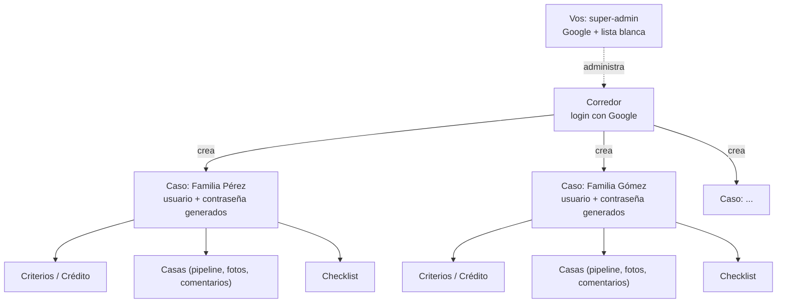

# De herramienta personal a SaaS para corredores

> Documento de arquitectura — Micaso · 13 sept 2026
> Estado: **diseño cerrado, sin construir** · Nace de Casa, en producción desde el 12 sept 2026 (41 propiedades, 3 personas usándolo a la fecha)
> Versión con diseño: [artifact publicado](https://claude.ai/code/artifact/613d03c0-8366-4fbd-b641-a59eb5383997)

Propuesta de arquitectura para convertir Casa — hoy una herramienta de uso
privado para una sola búsqueda — en un producto donde un corredor
inmobiliario paga una suscripción mensual y genera, dentro de su panel, un
acceso independiente por cada familia con la que está trabajando.

## 1. Por qué ahora

Una familia busca casa una vez cada varios años, durante unos meses. Un
corredor inmobiliario tiene varios casos abiertos en simultáneo, todo el
año, como trabajo permanente. El primero no sostiene una suscripción
mensual — el segundo sí.

Eso cambia quién es el cliente que paga. No es Lucas, ni Abril, ni ninguna
familia buscando su próxima casa: es Carolina — o cualquier corredor en su
lugar — que hoy ya cumple ese rol de manera informal en esta misma búsqueda
(coordina visitas, negocia con inmobiliarias, arma comparaciones). El
producto le da una herramienta profesional para hacer eso mismo con cada
uno de sus clientes, y a cada familia le llega gratis, vía un link, sin
saber ni que existe una capa de "cuenta corredor" por debajo.

> **Ya validado:** el caso de uso individual (una familia, un corredor
> informal, un crédito, una lista de propiedades) lleva desde el 9 de
> septiembre en uso real — no es una hipótesis, es la unidad que este
> documento propone multiplicar.

## 2. Panorama competitivo

Antes de construir nada vale la pena confirmar que el hueco es real, no
solo asumirlo. Investigación hecha el 13 de septiembre de 2026, separada
en cuatro categorías que a simple vista se confunden entre sí pero
resuelven problemas distintos.

### CRMs para corredores en Argentina y LatAm — gestión interna, no portal para el cliente

| | |
|---|---|
| **Tokko Broker** | se autodenomina "el CRM #1 de LatAm" — publica en 30+ portales, funnel de leads, búsqueda guardada por contacto con alerta automática por mail cuando aparece algo que matchea. En un ranking 2026 quedó detrás de KiteProp (7.0/10 vs 9.4/10): le falta WhatsApp nativo, tasador con comparables, firma digital biométrica. |
| **KiteProp** | hoy el mejor rankeado en Argentina — 30+ portales, WhatsApp nativo, IA para automatizar tareas, tasaciones con comparables. Presencia en Argentina y Chile. |
| **2clics** | más simple, pensado para oficina chica o corredor independiente — el perfil más parecido a Carolina. Funnel + botón de WhatsApp + publicación multi-portal, prueba gratis sin tarjeta. |
| **Xintel, Solution Malls, Datasync** | jugadores menores o de nicho (integraciones contables, sincronización multi-portal) — menor relevancia competitiva directa. |

Ninguno de los cuatro le da al cliente o familia un login propio para ver
su búsqueda. Todos resuelven "cómo gestiono mis leads y publico en
portales" — la alerta automática por mail de Tokko es lo más parecido a
"visibilidad del cliente" que existe hoy, y es un mail, no un panel vivo
con pipeline, comentarios y checklist.

### Portales de anuncios — no compiten, son la fuente

ZonaProp, ArgenProp, MercadoLibre y Properati son los sitios de donde Casa
ya scrapea (sección 5: stack). Alguno tiene "panel del cliente" para
búsquedas guardadas y alertas, pero es una función del portal para
cualquier usuario anónimo — no algo que un corredor arma y comparte con un
cliente puntual.

### Simuladores de crédito UVA — resuelven otra pregunta

CreditosUVA.ar, Valencia Neira, Somos Inmobiliarios e InfoZona son una
categoría madura y con varios jugadores — pero contestan "¿qué banco me
conviene?", comparando tasas de ~25 bancos. Micaso no compite acá: asume
que el crédito **ya está pre-aprobado** y contesta "con ese crédito,
¿cuánto necesito de bolsillo para esta casa puntual?" — un problema
distinto, sin superposición real.

### Portales de colaboración cliente-agente — la categoría existe, pero no acá

| | |
|---|---|
| **OneHome** (Cotality, ex-CoreLogic) | portal con marca del agente, comparación lado a lado, el cliente deja feedback por propiedad. Precio no público. |
| **Trackxi** | portal de cliente + tracker de transacción. US$ 39–199/mes según plan. |
| **Ahsuite** | portal de cliente genérico adoptado por agentes inmobiliarios. US$ 14–24/mes por usuario. |
| **Clinked, HAR Client Portal, SuiteDash** | variantes del mismo concepto, rangos de precio similares. |

Esto valida algo importante: el modelo de negocio funciona — un corredor
paga entre US$ 14 y US$ 200 por mes por esto. Pero ninguno opera en
Argentina, ninguno integra el cálculo hipotecario argentino, y ninguno se
conecta a MercadoLibre, ZonaProp, ArgenProp, RE/MAX o Mudafy como ya hace
Casa.

> **Veredicto:** no es un mercado vacío — la categoría "portal de
> colaboración" existe y factura en EEUU. Pero en Argentina el hueco es
> real: nadie combina portal para el cliente + cálculo hipotecario
> argentino + conexión a los portales locales. Los jugadores grandes de
> acá (Tokko, KiteProp) tienen la escala y la base de corredores para
> copiar esto rápido si lo ven funcionar — el diferenciador de Micaso no
> es tecnológico, es el enfoque, la velocidad de ejecución, y tener a
> Carolina validándolo en uso real ahora mismo (sección 12).

## 3. La unidad base: un caso

Todo lo construido hasta hoy es, en los términos de este documento, **un
caso**. El trabajo de arquitectura no es rehacer esto — es ponerle una capa
arriba que permita tener muchos al mismo tiempo, aislados entre sí, cada
uno con su propio acceso.

| | |
|---|---|
| **Criterios** | zonas de interés e imprescindibles en común a cualquier caso; el perfil financiero varía por tipo (ver abajo) |
| **Casas** | pipeline de 7 estados de búsqueda + papelera recuperable, fotos, comentarios, revisión de visita, plata necesaria calculada contra el presupuesto del caso |
| **Vistas** | comparación de destacadas, mapa aproximado por zona |
| **Checklist** | trámites y documentación, asignable entre los miembros del caso — plantilla distinta por tipo (ver abajo) |
| **Carga de propiedades** | pegar un link (MercadoLibre, ZonaProp, ArgenProp, RE/MAX, Mudafy) autocompleta título, fotos y precio |

### Tipo de caso: no todos buscan lo mismo

Comprar con crédito hipotecario y alquilar tienen un perfil financiero
distinto de raíz — no es solo una etiqueta, cambia qué datos hay que
pedir:

- **Compra:** capital disponible, crédito pre-aprobado (banco, monto,
  tasa), cuota estimada. Alimenta la calculadora de cuota francesa y la
  "plata necesaria" por casa, tal como existe hoy.
- **Alquiler:** presupuesto mensual y presupuesto de entrada (depósito,
  comisión inmobiliaria, primer mes, seguro de caución o garantía).
  Alimenta un cálculo distinto — gastos iniciales, no cuota francesa.
- **Otro:** sin calculadora específica por ahora — un campo de
  presupuesto libre alcanza hasta que haya un caso real de este tipo.

El checklist de trámites cambia igual de raíz (escritura y tasación no
tienen nada que ver con seguro de caución y recibos de sueldo). Lo único
100% común a los tres tipos es el pipeline de casas: estados, fotos,
comentarios, contacto, comparación y mapa no dependen de si el caso es
compra, alquiler u otra cosa.

## 4. Arquitectura objetivo

Tres niveles, no uno. Hoy existe un solo login compartido para todo el
mundo. El modelo nuevo separa **tu panel de super-admin** (uno solo, el
tuyo) de **el panel de cada corredor** (una cuenta por corredor) de
**cada caso** (un acceso propio por familia, generado desde el panel de
su corredor).

Cada caso es una copia aislada de lo que existe hoy — nada se comparte
entre familias.

### Autenticación — tres puertas, una sola con OAuth

- **Vos (super-admin) → tu panel:** el mismo login con Google que un
  corredor, pero tu email vive en una lista blanca (`ADMIN_EMAILS`) que
  te manda a un panel distinto — no hace falta un sistema de roles
  aparte.
- **Corredor → panel:** login con Google. **Decisión revisada** respecto
  a la primera versión de este documento, que proponía usuario/contraseña
  propio — tiene más sentido OAuth para un cliente que vuelve todos los
  días y entra desde una landing pública: sin contraseña que recuperar,
  signup más corto. Sesión larga, ve la lista de sus casos.
- **Caso → familia:** usuario/contraseña simple generados al crear el
  caso (no elegidos a mano por el corredor). Cortos está bien — no se
  comparte información bancaria — pero siguen siendo generados al azar y
  únicos por caso, nunca un `1234` repetido entre casos: el presupuesto o
  el teléfono de contacto de una familia no es "sensible" en sentido
  legal, pero tampoco es para que lo mire el cliente de otro corredor
  adivinando una URL.

### Namespacing de datos

Hoy cada colección vive en una clave global de Redis. Pasa a estar
prefijada por caso:

| Hoy | Con casos |
|---|---|
| `houses` | `case:{caseId}:houses` |
| `checklist` | `case:{caseId}:checklist` |
| `criteria` | `case:{caseId}:criteria` |
| *(no existe)* | `brokers` — cuentas de corredor: login, `nombreMarca`/`imagenUrl`, y estado de suscripción (`mpPreapprovalId`, `subscriptionStatus`, `trialEndsAt`) |
| *(no existe)* | `cases` — metadata: **título del caso** (editable, no fijo desde la creación), credenciales, `brokerId`, fecha de creación, `estado` (activo/cerrado) |

## 5. Stack tecnológico

Lo mínimo nuevo para no reinventar lo que ya resuelven bien otros.

### Ya en uso, sin cambios

- **Next.js 16 (App Router) + React 19 + TypeScript + Tailwind CSS v4** —
  el mismo stack de hoy. Esta capa lo extiende, no lo reescribe.
- **Vercel** — hosting y auto-deploy desde GitHub. El proyecto sigue
  siendo uno solo; no hace falta infraestructura separada para
  multi-tenant.
- **Upstash Redis** — sigue siendo la base de datos, ahora particionada
  por caso (ver sección 4). Por qué alcanza por ahora, y cuándo dejaría
  de alcanzar: ver abajo.
- **Leaflet + OpenStreetMap** — el mapa aproximado por zona no cambia.
- **El scraper actual** (meta tags, JSON-LD, sin navegador headless) — la
  lógica no cambia, solo el volumen (ver riesgo de escala en sección 9).

### Nuevo, hay que sumarlo

- **Auth.js** (ex-NextAuth) con proveedor de Google — resuelve el login
  OAuth de corredor y super-admin. Es la opción estándar en Next.js para
  esto; evita escribir el flujo de OAuth a mano.
- **Mercado Pago** (Suscripciones / API de Preapproval) — cobro recurrente
  y notificaciones de pago para enterarse de altas, rechazos y
  cancelaciones. Reemplaza a Stripe (ver sección 9: Stripe no es viable
  para un negocio radicado en Argentina). A diferencia de Stripe, no trae
  un Customer Portal alojado — cambiar de plan o cancelar necesita una
  pantalla propia mínima (ver sección 8), algo que con Stripe no hubiera
  hecho falta construir.
- **Dominio propio** — hoy la app original vive en
  `home-blush-one.vercel.app`; una landing pública que le vende a
  desconocidos necesita un dominio de verdad. Nombre público del
  producto: **decidido, se llama Micaso** (ver sección 11) — "Casa" queda
  como nombre interno/histórico de la herramienta original, no como marca
  pública.
- **Almacenamiento de imágenes subidas** (Vercel Blob u otro) — hoy todas
  las fotos de la app vienen de URLs externas (scrapeadas de un aviso, o
  pegadas a mano en el editor); la foto de perfil del corredor es la
  primera imagen que alguien sube de verdad en vez de pegar un link, así
  que hace falta un lugar donde guardarla.

### Deliberadamente no se suma nada

- **Servicio de email transaccional** (Resend, SendGrid, etc.) — Mercado
  Pago también notifica cobros exitosos y fallidos a quien paga por sus
  propios medios; a confirmar cuando se implemente si alcanza sin sumar
  nada más, pero la idea de no construir un servicio de mail aparte para
  v1 se mantiene.
- **Herramienta de analytics propia** — las métricas del panel de
  super-admin (sección 7) pueden salir directo del dashboard de Mercado
  Pago (altas, bajas, ingreso mensual) en vez de calcularlas a mano; solo
  la lista de corredores y las acciones manuales necesitan pantalla
  propia.

### Base de datos: por qué Redis alcanza por ahora, y cuándo dejaría de alcanzar

Hoy cada colección (`houses`, `checklist`, `criteria`) vive en una sola
clave por caso, guardada como un array — leer o escribir un solo campo de
una sola casa implica traer y volver a guardar el array completo. Es una
limitación ya documentada y aceptada para 3 personas en un caso; con
casos multiplicándose, sigue siendo aceptable **si cada caso mantiene un
volumen chico** (decenas de casas, no miles), porque el "radio de
explosión" de una escritura pesada queda contenido dentro de un caso, no
de toda la plataforma.

**Mejora barata, sin cambiar de tecnología:** el próximo paso natural —ya
anticipado en el README de Casa— es que cada casa pase a ser su propia
clave (`case:{caseId}:house:{houseId}`) en vez de un elemento de un array
compartido. Sigue siendo Redis, sigue siendo el mismo Upstash, pero
actualizar el checklist de una casa deja de tocar las otras cuarenta.

**Cuándo de verdad conviene otra base de datos (Postgres u otra
relacional):** el disparador no es "cuántos corredores" — es que la
decisión de la sección 6 (casos siempre aislados, sin vista unificada)
cambie. Consultar propiedades cruzando varios casos, o darle al panel de
super-admin reportes de verdad en vez de una lista simple, son consultas
relacionales que Redis hace mal y Postgres hace bien de fábrica. Ninguna
de las dos está decidida como necesaria hoy, así que migrar de base de
datos es resolver un problema que todavía no existe.

> **En resumen: una sola base de datos, no una por corredor.** El
> aislamiento entre casos es por nombre de clave (`case:{caseId}:...`,
> sección 4), no por infraestructura separada — crear un caso nuevo
> agrega un puñado de claves a la misma base, nunca una base nueva. Nada
> de lo nuevo agrega otra base de datos de verdad: Auth.js con Google
> puede andar con la sesión en una cookie firmada, sin guardar nada en
> Redis; Mercado Pago guarda la facturación de su lado (solo
> referenciamos un ID); y el storage de imágenes guarda archivos sueltos,
> no reemplaza a Redis ni lo complementa con más tablas.

## 6. Panel del corredor

Tres momentos distintos: la landing lo convence, el alta lo registra, el
panel lo engancha todos los días.

### Landing: convencer al corredor, no a la familia

Página pública de marketing, dirigida al corredor — nunca a una familia
(esa nunca la ve, entra directo por su link de caso). Necesita una
propuesta de valor concreta ("organizá a cada cliente de búsqueda de casa
en un lugar, con su propio link privado"), el precio a la vista, y un
único CTA: **empezar prueba gratis**.

### Alta y prueba — sin pedir tarjeta

El alta es entrar con Google — sin formulario de contraseña, la identidad
y el email vienen de la cuenta que usa para loguearse (ver sección 4). Al
entrar por primera vez se le pide nombre de marca para su panel, nada
más. **Decidido: prueba de 14 días sin pedir tarjeta** — entra directo a
un panel vacío, puede crear casos de prueba, y recién al terminar la
prueba se le pide un método de pago para seguir.

### Cobro — plan fijo, con tope de casos activos

**Decisión revisada:** un precio mensual fijo, pero no todo-lo-que-quieras
— la versión anterior de este documento lo dejaba sin tope. Cada plan
incluye una cantidad máxima de **casos activos simultáneos**; abrir más
que eso implica pasar a un plan superior o un cargo por caso extra. Sigue
sin ser cobro por-caso puro — eso ya se había descartado por complicar la
facturación desde el día uno — pero tampoco es un precio plano
desconectado de cuánto usa la herramienta un corredor grande frente a uno
chico.

**Decidido (14 sept 2026): precio y topes — ver sección 11** para el
análisis de costos y el razonamiento completo. Los tres planes:

| Plan | Tope de casos activos | Precio |
|---|---|---|
| Para arrancar | 5 | USD 13/mes (referencia; cobro en pesos) |
| Para tu cartera | 20 | USD 29/mes (referencia; cobro en pesos) |
| Volumen alto | a medida | a convenir, sin número fijo |

Esto es la razón concreta por la que **cerrar un caso** deja de ser solo
prolijidad — ver "Ciclo de vida de un caso" abajo.

Al terminar la prueba (o antes, si el corredor decide pagar de una), se
inicia una suscripción con **Mercado Pago** (API de Preapproval) — Stripe
quedó descartado como procesador porque no habilita cuentas para recibir
pagos a un negocio radicado en Argentina (ver sección 9). A diferencia de
lo pensado originalmente con Stripe, Mercado Pago no ofrece un portal
alojado equivalente al Customer Portal: cambiar de plan o cancelar
necesita una pantalla propia mínima dentro del panel (ver sección 8), en
vez de tercerizarla del todo. Si falla un cobro o no carga tarjeta al
terminar la prueba, la respuesta por ahora es pasar el panel a
solo-lectura hasta que se resuelva, no cortar el acceso de un día para el
otro (detalle sin cerrar del todo, ver sección 9).

### Ciclo de vida de un caso: cuánto dura un link

**Decidido: el corredor cierra el caso a mano, no expira solo.** Mientras
un caso está activo, su link no tiene fecha de vencimiento — dura lo que
dure la búsqueda real, sea un mes o un año. El corredor necesita un botón
explícito para **cerrar y terminar** un caso cuando la familia ya compró,
alquiló, o simplemente dejó de buscar.

Al cerrar un caso:
- Deja de contar contra el tope de casos activos del plan (ver Cobro,
  arriba) — el incentivo para el corredor es real, no solo prolijidad.
- Pasa a modo solo-lectura en vez de cortarse de un día para el otro —
  mismo criterio que si el corredor deja de pagar (sección 9): la familia
  sigue viendo su historial, pero no puede seguir cargando casas ni
  comentarios nuevos.

Esto es más simple que el "archivado automático" que ya está fuera de
alcance (sección 10): ahí lo que se descarta es que el sistema *detecte
solo* que una compra se cerró; esto es un botón que aprieta el corredor
cuando él sabe que terminó, nada de inferir nada.

### Una vez adentro: qué ve el corredor

Lo mínimo que necesita el panel para ser útil desde el primer día:

- Lista de casos: nombre del cliente, link/credenciales para copiar y
  mandar, un resumen rápido (cuántas pendientes, destacadas, última
  actividad).
- Botón para crear un caso nuevo — genera usuario/contraseña, le pone un
  título (ver abajo) y arranca ese caso vacío. Bloqueado si ya llegó al
  tope de casos activos de su plan. **Decidido: pide solo lo mínimo**
  (título, tipo de caso) para no frenar al corredor con un formulario
  largo — los criterios (presupuesto, zonas, crédito o alquiler) se
  completan después, desde la misma pantalla de Criterios que ya existe
  hoy: el corredor los carga si ya los tiene de charlar con el cliente, o
  la familia los completa ella misma la primera vez que entra con su
  link. No hace falta un asistente de onboarding aparte — es el mismo
  formulario editable de siempre, quien llegue primero lo llena.
- Botón para cerrar un caso (ver "Ciclo de vida de un caso", arriba) — y
  un indicador de cuántos casos activos tiene contra el tope de su plan.
- Sin las 41 propiedades de Lucas de arranque: cada caso nuevo empieza en
  blanco, no con el seed actual (ver sección 8).
- **Marca propia:** nombre e imagen de perfil (una foto personal sirve
  igual que un logo — muchos corredores individuales, como Carolina, no
  tienen uno) que el corredor carga una vez en su panel y se muestran en
  todos los casos que ve su cliente — la familia nunca ve "Micaso" como
  marca, ve la del corredor. Decidido: sí va, ver sección 8.
- **Título del caso, editable:** el corredor le pone un nombre a cada caso
  al crearlo (ej. "Familia Pérez") y puede cambiarlo cuando quiera — no es
  solo una etiqueta interna para ordenarse, es lo que la familia ve como
  encabezado dentro de su propio caso.

> **Decidido: casos siempre aislados, sin vista unificada en v1.** Cada
> propiedad pertenece a un único caso — no hay relación muchos-a-muchos
> entre casas y casos. Si más adelante un corredor necesita evitar cargar
> la misma dirección dos veces en casos distintos, alcanza con una
> búsqueda de solo lectura entre sus propios casos (una consulta, no un
> cambio de modelo de datos) — se agrega cuando haga falta, no ahora.
> Esto también baja la urgencia de migrar a una base relacional (sección
> 5): sin necesidad real de cruzar datos entre casos, Redis con el
> namespacing actual sigue alcanzando.

## 7. Tu panel de super-admin

Una capa más arriba de todo: vos administrando la plataforma completa, no
un caso ni un corredor puntual.

**Mismo login, otro destino.** No hace falta un sistema de roles nuevo:
entrás con el mismo Google OAuth que un corredor, pero tu email está en
una lista blanca (`ADMIN_EMAILS`) que te redirige a `/superadmin` en vez
de al panel de corredor.

**Decidido: control total.** Además de ver la lista completa de
corredores (estado de suscripción, plan, métricas básicas — activos, en
prueba, ingreso mensual total), el panel te deja actuar directamente:
editar una suscripción a mano, extender una prueba, crear o dar de baja
un corredor sin pasar por Mercado Pago. Tiene sentido ahora, con pocos
corredores manejados uno por uno — pero mezcla "soporte" con "operación
interna" en un solo lugar, y conviene separarlos el día que haya
demasiados corredores para tocarlos a mano de a uno.

> **De paso, resuelve el alta del primer corredor real:** con la landing
> todavía sin publicar, das de alta a Carolina a mano desde este panel en
> vez de esperar a que pase por el flujo de signup público — el mismo
> mecanismo (Google OAuth) sirve para los dos casos.

## 8. Qué cambia respecto al código de Casa

Es una extensión del código existente de `D:\Casa`, no una reescritura.
Los archivos que tocaría esta capa (rutas relativas al repo de Casa, que
serviría de base para este proyecto):

| Archivo | Cambio |
|---|---|
| `proxy.ts` | tres chequeos en vez de uno: sesión de Google (corredor o super-admin, según el email) para `/panel/*` y `/superadmin/*`, cookie de caso simple para todo lo demás |
| `lib/store.ts` | cada función (`getHouses`, `updateHouse`, `addComment`...) recibe un `caseId` y lo antepone a la clave |
| `lib/seed.ts` | deja de aplicar tal cual — un caso nuevo arranca vacío, no con la búsqueda real de Lucas; `SEED_CHECKLIST` deja de ser una única lista y pasa a ser una plantilla por `tipoCaso`, elegida al crear el caso |
| `lib/auth.ts` | la constante `SITE_PASSWORD` desaparece — el login de corredor y de super-admin pasan a Auth.js (Google OAuth), el segundo con un chequeo extra contra `ADMIN_EMAILS`; solo el login de caso sigue siendo una credencial simple generada, guardada en `cases` |
| nuevo: `lib/cases.ts` | crear caso (con su título inicial y `id` tipo UUID), generar credenciales, listar casos de un corredor, editar el título de un caso ya creado, **regenerar la contraseña de un caso** (si se sospecha una filtración), cerrar un caso (pasa a solo-lectura y libera un lugar del tope); frena la creación de uno nuevo si el corredor ya llegó al tope de su plan |
| nuevo: rate limiting de login de caso | contador de intentos fallidos en Redis con TTL de 15 min; bloquea después de 10 intentos — vive en la ruta de login de caso, no en `proxy.ts` |
| nuevo: Vercel Cron (diario) | revisa casos en solo-lectura hace más de 90 días y los archiva (el link deja de funcionar; reactivable si el corredor vuelve a pagar) |
| `lib/types.ts` | dos cambios: `PEOPLE` (hoy una constante fija Lucas/Abril/Carolina) pasa a ser una lista definida al crear cada caso; y `Criteria`/`LoanInfo` (hoy asumen compra con crédito) pasan a variar según un nuevo campo `tipoCaso` (compra/alquiler/otro), cada uno con su propio perfil financiero |
| `lib/mortgage.ts` | `frenchInstallment()` y `cashNeededRange()` aplican solo a `tipoCaso` "compra" — alquiler necesita su propio cálculo (depósito + comisión + primer mes + seguro de caución o garantía) en vez de cuota francesa |
| `components/Nav.tsx` | hoy tiene `"Casa"` hardcodeado como marca — pasa a leer nombre e imagen del corredor dueño del caso, más el título de ese caso puntual; `brokers` necesita campos `nombreMarca` / `imagenUrl` |
| nuevo: `app/api/upload/route.ts` | recibe la imagen de perfil que sube el corredor, la guarda en el storage elegido (ver sección 5) y devuelve la URL para `brokers.imagenUrl` — hoy la app nunca recibe un archivo subido, solo URLs externas |
| `app/page.tsx` | hoy es el Inicio (dashboard) del caso único y vive en la raíz `/`; con landing pública, la raíz pasa a ser la landing de marketing y el dashboard de un caso se corre a otra ruta |
| nuevo: rutas del corredor | alta (login con Google vía Auth.js) y `app/panel/*` (lista de casos, crear caso, configurar marca, y una pantalla mínima de cambiar de plan/cancelar ya que Mercado Pago no trae un portal alojado como el de Stripe) — hoy no existen, todo el código actual asume un solo caso ya autenticado |
| nuevo: `app/superadmin/*` | panel de super-admin — lista de corredores, métricas, edición manual de suscripciones; protegido por el mismo login de Google + `ADMIN_EMAILS` |
| nuevo: `app/api/mercadopago/webhook/route.ts` | recibe notificaciones de Mercado Pago (pago exitoso, pago rechazado, cancelación de la suscripción) y actualiza `subscriptionStatus` en `brokers` |

> **No es solo agregar código:** el caso actual de Lucas y Abril — 41
> propiedades reales, en producción desde el 12 de septiembre en
> `D:\Casa` — tendría que migrar a ser el primer caso real dentro de
> Micaso (probablemente bajo la cuenta de Carolina como primera
> corredora), en vez de quedar aparte. Vale la pena planear esa migración
> puntual cuando llegue el momento, para no perder el historial ya
> construido.

## 9. Riesgos y agujeros que encontré

Ninguno bloquea seguir — todos son más baratos de resolver ahora, por
escrito, que después de tener corredores pagando.

**Scraping a escala comercial, no personal**
Hoy el scraper le pega a MercadoLibre, ZonaProp, ArgenProp, RE/MAX y
Mudafy para 3 personas. Convertir esto en un producto pago que se apoya en
ese mismo scraping para muchos corredores cambia la naturaleza del asunto
— de conveniencia personal a extraer datos de terceros como parte de un
producto comercial. Antes de vender esto, conviene una revisión real de
los términos de uso de esos sitios, no asumir que lo razonable para 3
personas lo sigue siendo a escala.

**Costo de infraestructura — resuelto (14 sept 2026), con supuestos
explícitos en vez de datos medidos**
Upstash cobra por volumen de comandos y almacenamiento; Vercel por
invocaciones de función y ancho de banda. El proxy de imágenes
(`/api/image`) en particular hace pasar cada foto de cada aviso por
nuestro servidor — escala directo con corredores × casos × fotos. Sin un
caso real corriendo todavía en Micaso (Carolina sigue en `D:\Casa`), no
hay datos medidos — pero alcanza con los precios públicos de cada
proveedor (verificados 14 sept 2026) y un supuesto de uso conservador:

- **Fijo de la plataforma, no depende de cuántos corredores haya:**
  Vercel Pro USD 20/mes (Hobby no permite uso comercial) + dominio
  prorrateado (~USD 1,5/mes) + Upstash Redis USD 0 (free tier: 500K
  comandos/mes y 256MB, alcanza mucho tiempo antes de necesitar el plan
  pago) ≈ **USD 22/mes en total**, sea 1 corredor o 50.
- **Marginal por caso activo/mes:** Redis (lecturas/escrituras de
  pipeline, checklist, comentarios) cuesta centavos de dólar incluso a
  varias decenas de casos ($0,20 cada 100K comandos, $0,25/GB de storage
  pasado el primer GB gratis). El driver más variable es el ancho de
  banda del proxy de imágenes: con el supuesto de ~40 casas × 8 fotos ×
  300KB revisualizadas ~20 veces/mes, un caso mueve del orden de 2GB/mes
  — muy por debajo del 1TB incluido en Vercel Pro hasta varios cientos de
  casos simultáneos (pasado eso, USD 0,15–0,35/GB según región). El
  storage de la foto de perfil del corredor (Vercel Blob) es insignificante,
  es por corredor, no por caso.

**Conclusión: el costo no es la restricción para fijar precio.** Con los
volúmenes esperados (decenas de casos por corredor, no miles — ya
asumido arriba), cualquier precio de plan por encima de unos pocos
dólares por mes deja margen bruto superior al 90%. El techo real es
cuánto esté dispuesto a pagar un corredor — ver sección 11 para el precio
decidido y sección 12 para la validación con Carolina, que sigue
pendiente.

**Seguridad de las credenciales por caso — ya resuelto**
- **Límite de intentos:** bloquear el login de un caso después de 10
  intentos fallidos por 15 minutos — un contador simple en Redis con
  vencimiento automático (TTL), no hace falta un servicio aparte.
- **Identificador no-adivinable:** el ID del caso en la URL es un UUID
  igual que el resto de los IDs del sistema (`crypto.randomUUID()`, ya se
  usa en todo el código actual), no un número secuencial. Es gratis, no
  hay razón para no hacerlo.
- **Rotar una contraseña filtrada sin cortar el acceso:** un botón
  "regenerar contraseña" en el panel del corredor genera una nueva al
  azar para ese caso, manteniendo el mismo ID/URL. El corredor le reenvía
  la nueva contraseña a la familia por WhatsApp — no hace falta cerrar el
  caso ni perder el historial.

**Qué pasa si el corredor deja de pagar — ya resuelto**
Modo solo-lectura inmediato (sección 6), con todo visible tal cual
estaba — fotos, comentarios, historial completo; nada se oculta, solo se
bloquea la escritura. Después de **90 días** en solo-lectura sin que el
corredor reactive la suscripción, el caso pasa a archivado: el link deja
de funcionar (reactivable si el corredor vuelve a pagar, restaurándolo
desde su panel). Noventa días le da tiempo de sobra a un corredor que
canceló por error o está resolviendo un problema de pago, sin sostener
indefinidamente el caso de alguien que ya se fue de verdad.

**Sin tests, y ahora hay más para perder**
Hoy no hay ningún test automático en Casa (ver su CLAUDE.md) — razonable
para una herramienta de 3 personas que se prueba a mano. Pero el
aislamiento entre casos de distintos corredores es exactamente el tipo de
bug (un caso viendo o pisando datos de otro por una clave de Redis mal
armada) que una revisión manual detecta tarde y un test automático
previene antes de llegar a producción. No hace falta un framework de
testing completo — alcanza con un puñado de tests de integración que
confirmen que las claves de `case:{caseId}:...` nunca se cruzan entre
casos distintos, antes de tener un segundo corredor real con datos ajenos
en juego.

**Riesgo competitivo: los jugadores grandes podrían copiar el enfoque**
El panorama competitivo (sección 2) muestra que ningún competidor local
hace hoy lo que hace Micaso, pero Tokko Broker y KiteProp ya tienen la
base de corredores, el presupuesto y el equipo para agregar un "portal
para el cliente" como feature nueva si ven que el modelo funciona. El
moat de Micaso no es tecnológico — es llegar primero, ejecutar rápido, y
construir la relación con corredores reales (empezando por Carolina)
antes de que a alguno de los grandes le convenga copiarlo.

> **Segunda revisión (13 sept, más tarde):** cinco cosas más aparecieron
> al releer el documento completo de punta a punta. Cuatro se resolvieron
> ese mismo día — una con una búsqueda real, tres con una decisión de
> diseño —; a la quinta se le decidió el alcance, pero le falta la letra
> real (ver abajo).

**Stripe no es viable para cobrar desde Argentina — confirmado, resuelto
con Mercado Pago**
Confirmado con una búsqueda real (13 sept 2026): Argentina no está entre
los cerca de 46 países donde Stripe permite abrir una cuenta para
*recibir* pagos — la única vía sería armar una entidad en el exterior
(tipo Stripe Atlas), lo cual agrega costo y complejidad injustificados en
esta etapa. **Decisión: el procesador de cobro pasa a ser Mercado Pago**
(Suscripciones / API de Preapproval) — además de ser viable para un
negocio argentino, es la opción que cualquier corredor local ya conoce y
confía, y resuelve mejor la facturación AFIP (que Stripe nunca iba a
dar). Diferencia real a tener en cuenta: Mercado Pago no trae un Customer
Portal alojado como el de Stripe — pausar, cancelar o cambiar de plan se
arma vía su API, así que esa pantalla de autogestión (que se había
decidido explícitamente no construir a mano) probablemente haya que
construirla igual, aunque sea mínima. Todas las referencias a Stripe en
el resto del documento (secciones 4, 5, 6, 8 y 10) ya se actualizaron a
Mercado Pago.

**El modelo de datos de `cases.estado` — resuelto: pasa a tres valores**
`estado` pasa de `activo/cerrado` a **`activo` / `solo_lectura` /
`archivado`**. Impago y cierre manual comparten el mismo camino hasta
`solo_lectura`, pero divergen ahí: el impago espera los 90 días de
gracia ya definidos (arriba) antes de archivarse, porque ese plazo existe
para darle margen a un error de pago real. Un cierre manual, en cambio,
**archiva de inmediato** — el corredor ya confirmó que el caso terminó,
no hay nada que "arreglar" esperando. Ambos caminos siguen siendo
reactivables desde el panel del corredor.

**Cuándo se cargan los nombres de la familia de un caso — resuelto**
Mismo criterio que ya se usa para los Criterios: nadie los pide al crear
el caso. La primera vez que cada integrante de la familia entra con el
link del caso, se le pregunta una sola vez "¿cómo te llamás?" y ese
nombre se agrega a la lista `PEOPLE` de ese caso — se recuerda en su
dispositivo (cookie o local storage) para no volver a preguntarlo. El
corredor puede cargar un nombre a mano si ya lo sabe, pero no es
obligatorio para crear el caso.

**Abuso de la prueba gratis sin tarjeta — resuelto: riesgo aceptado**
No se mitiga en v1. Mientras el producto se prueba con conocidos y
corredores captados a mano (sección 7), el costo de alguien reiniciando
su propia prueba con una cuenta de Google nueva es bajo — se revisita
si alguna vez se vuelve un problema real observado, no antes.

**Política de privacidad y términos de servicio — parcialmente resuelto:
falta el texto, no el alcance**
Lo que sí se puede decidir ahora sin escribir la letra chica: hacen falta
**dos documentos distintos, no uno**. **Términos de servicio**, para el
corredor — cubre la suscripción, y deja explícito que el corredor es
responsable de tener el permiso de su cliente para cargar sus datos en la
plataforma; la relación comercial es entre corredor y familia, no entre
la plataforma y la familia. **Política de privacidad**, para la familia
— se muestra la primera vez que entra con su link, y cubre qué guarda la
plataforma (presupuesto, contacto, fotos, comentarios), quién puede verlo
(su corredor y vos como super-admin; nunca otro corredor ni otra
familia), y qué pasa con eso si el caso se cierra o se archiva (ya
resuelto arriba). Lo que sigue sin resolver es la letra real: redactarla
con cuidado (idealmente con alguien que conozca la ley de protección de
datos argentina) antes de publicar la landing — eso ya no es una
decisión de diseño, es contenido que no se improvisa en una tarde.

**Condición de carrera en el store local — pasó de verdad (14 sept
2026), resuelto para local; queda un resto menor en Redis**
El fallback de archivo local (`.data/store.json`, usado en desarrollo
sin credenciales de Upstash configuradas) perdió datos reales una vez:
cada mutación hacía su propio "leer todo el archivo" y, en una llamada
aparte, su propio "guardar todo el archivo" — dos requests
concurrentes leen el mismo estado viejo, y el segundo guardado pisa
por completo lo que el primero acababa de escribir. Se perdieron
`case:demo:houses`, `case:demo:criteria`, `case:demo:checklist` y
`brokers` enteros (se recuperaron sin pérdida real porque las
propiedades y el checklist demo viven como semilla en `lib/seed.ts`,
y el perfil del corredor se recrea solo desde la sesión de Google).
**Resuelto para el store local:** `lib/db.ts` expone `dbUpdate(key,
mutate)`, que hace lectura+escritura como una sola operación atómica;
se reescribió cada punto del código que hacía "leer, después guardar"
por separado (`lib/cases.ts`, `lib/brokers.ts`, `lib/store.ts`) para
usarla. Confirmado con un test de estrés real (15 creaciones de caso
concurrentes): antes del arreglo sobrevivía 1 de 15, después las 15.
**Sin resolver del todo en Redis (producción):** `dbUpdate` ahí sigue
siendo un GET y despues un SET, no una transacción real (no hay
WATCH/MULTI vía el cliente REST de Upstash que se usa) — el mismo
patrón de carrera podría repetirse con dos requests verdaderamente
simultáneas para el mismo caso. Riesgo aceptado por ahora: Vercel rara
vez sirve dos requests al mismo tiempo para el mismo caso con el
volumen esperado (sección 9, "Costo de infraestructura"). Si alguna
vez se vuelve un problema real observado, la solución es mover el
índice de casos por corredor y la lista de casos a estructuras
atómicas nativas de Redis (`SADD`/listas) en vez de un objeto JSON
grande por clave.

## 10. Fuera de alcance (v1)

Explícitamente afuera hasta tener señal real de que el resto funciona:

- OAuth para el acceso de un caso — sigue siendo usuario/contraseña
  simple para esa puerta (ver sección 4); Google OAuth ya está decidido,
  pero solo para corredor y super-admin.
- Construir el cobro de verdad (Mercado Pago) — el modelo ya está diseñado
  (sección 6: plan fijo mensual + prueba de 14 días sin tarjeta), pero no
  se escribe una línea de código hasta confirmar que alguien más, además
  de Carolina, pagaría (ver sección 12).
- Equipos / múltiples corredores por inmobiliaria compartiendo casos.
- Geocodificación real de direcciones — el mapa sigue siendo aproximado
  por zona.
- Scraping fuera de los sitios argentinos ya soportados.
- Archivado automático de un caso al cerrarse la compra.
- Notificaciones agregadas entre casos (mail/WhatsApp cuando algo cambia
  en cualquiera) — decidido que no hace falta, al menos para v1.

## 11. Parámetros a definir al lanzar

Ninguno de estos bloquea el diseño — son números y decisiones de
negocio, no arquitectura, y no hace falta resolverlos para considerar
este documento completo.

**Precio y tope de casos incluidos por plan — decidido (14 sept 2026),
sin esperar la validación de la sección 12.** El cálculo de costo de
infraestructura (sección 9) confirmó que el costo no es la restricción —
cualquier precio razonable deja margen enorme. Lo que faltaba, y sigue
faltando, es la segunda pata original de este párrafo: lo que Carolina
(u otro corredor) esté realmente dispuesta a pagar, algo que todavía no
se le preguntó. Coherente con la decisión general del proyecto de no
esperar validación de pago para avanzar, se publicó un precio de
lanzamiento igual, apoyado en dos referencias externas en vez de en la
respuesta de Carolina:

- **2clics** (CRM inmobiliario completo — sitio propio, multi-portal,
  WhatsApp, mucho más alcance que Micaso): ARS 60.545–173.745/mes, unos
  USD 39–112 al dólar blue del 14 sept 2026 ($1.545).
- **Portales de colaboración cliente-agente en EEUU** (sección 2, ya
  investigado): USD 14–199/mes.

Micaso es más angosto que un CRM completo (no publica en portales, no
arma embudo de ventas), así que el ancla elegida queda más cerca del piso
de esos rangos — como herramienta complementaria, no reemplazo de CRM:

| Plan | Tope de casos activos | Precio |
|---|---|---|
| Para arrancar | 5 | USD 13/mes |
| Para tu cartera | 20 | USD 29/mes |
| Volumen alto | a medida | a convenir (botón "Hablar con nosotros", no cobro automático) |

Los topes de casos (5 y 20) son una suposición de partida, no un dato
medido — ningún corredor real todavía maneja múltiples casos simultáneos
en Micaso. Precio mostrado en USD como referencia en la landing; el cobro
real vía Mercado Pago es en pesos al tipo de cambio del día (Argentina
tiene inflación alta, un ARS fijo se desactualizaría rápido). Todo esto
es precio de lanzamiento, no un número grabado en piedra — se revisa en
cuanto haya uso real o la respuesta de Carolina de la sección 12.

**Nombre público del producto — resuelto: Micaso**
De cara al corredor y a la familia, el producto se llama **Micaso** —
juego de palabras con "mi casa", y además el nombre literal de la unidad
del producto (un "caso" por familia, sección 3). "Casa" queda como
nombre interno/histórico de la herramienta original en `D:\Casa`.
Verificado sin conflictos con proptech existente y sin sitio activo en
`micaso.com.ar`. Falta solo confirmar disponibilidad real y comprar el
dominio antes de publicar la landing — eso ya no es una decisión, es un
trámite.

## 12. Camino de validación sugerido

> **Actualización (14 sept 2026):** este camino de validación dejó de ser
> un gate para escribir código. Lucas decidió construir Micaso igual,
> como proyecto personal para aprender — sin importar si alguien paga
> todavía; eso se evalúa más adelante. Lo que sigue abajo queda como
> registro de las señales reales ya observadas con Carolina, y como algo
> a retomar cuando la construcción esté más avanzada, no como condición
> para empezar.

**No construir nada de esto todavía — pero ya hay una señal real que vale
la pena seguir.**

> **Señal — 13 sept 2026:** Carolina vio la propuesta y reaccionó bien:
> dice que tiene potencial y que ella lo usaría. Es una señal real, pero
> todavía barata — es fácil ser generosa con algo que un amigo construyó.
> La pregunta que todavía no tiene respuesta es si lo *pagaría*, no si lo
> usaría gratis.

> **Segunda señal — 13 sept 2026:** Carolina pidió algo concreto que la
> herramienta no tenía: un checklist de verificaciones propio por casa
> (no el general de trámites — uno por propiedad, tipo "pedir informe de
> dominio"). Ya está construido y en producción. Es exactamente lo que
> el párrafo de abajo proponía observar — "qué carga que hoy no carga,
> qué le falta" — pasando solo, sin que nadie se lo pidiera como parte de
> un test formal. Sigue sin responder si pagaría, pero ya es uso real
> generando pedidos reales, no una opinión sobre una propuesta.

El caso de uso ya está corriendo en vivo con Carolina cumpliendo, de
manera informal, exactamente el rol que este documento propone
formalizar. Antes de invertir en la capa multi-caso, vale más observar
cómo usaría ella la herramienta si fuera realmente "suya": qué carga que
hoy no carga, qué le falta para coordinar visitas de varias familias el
mismo día, si de verdad completaría contacto, próxima acción y revisión
de visita en cada propiedad o si eso termina siendo fricción.

> **Prueba barata antes de multi-tenant real:** pedirle a Carolina que la
> use esta semana con un caso real y actual suyo — no hipotético — usando
> el truco de una segunda instancia del mismo repo (otro proyecto de
> Vercel, base de datos vacía), sin escribir una sola línea de código
> nueva. Y preguntarle directo si pagaría algo mensual por esto, aunque
> sea un monto simbólico de "primera corredora". "Me gusta" y "pagaría $X
> por mes" son respuestas distintas — la segunda es la que de verdad
> valida el negocio, y recién ahí tiene sentido arrancar con la
> construcción real.
